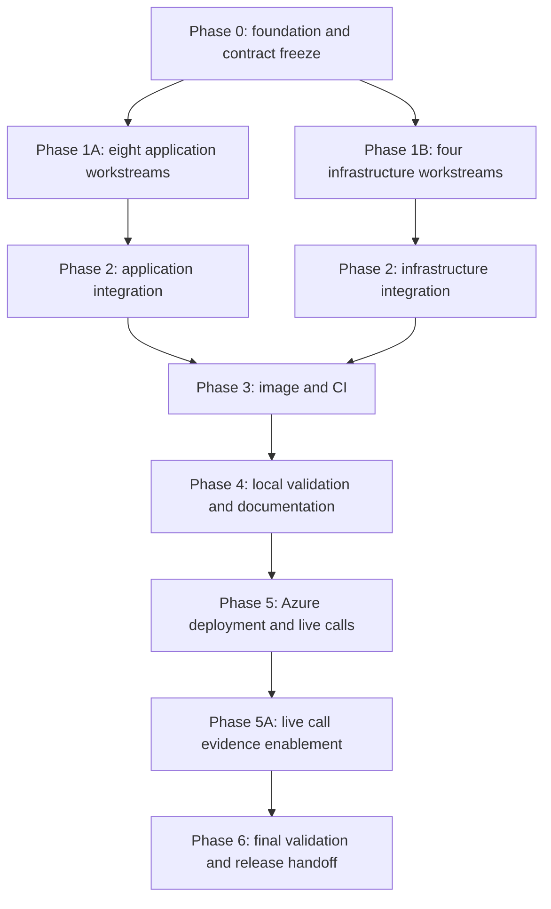

<!-- markdownlint-disable-file -->
# Implementation Plan: AskMyHuman Tight MVP

## Overview

Implement one synchronous AskMyHuman service that lets an authenticated agent
call one configured human for approval or one spoken answer, using independently
owned workstreams that converge through controlled application and infrastructure
integration.

## Objectives

### User Requirements

* Build a very tight MVP and ship it quickly. Source: user request on 2026-09-15.
* Let an agent request approval or free-form input. Source: README.md (Lines 6-7).
* Route every request to one owner configured through `MY_MOBILE_NUMBER`. Source: README.md (Lines 7-8).
* Reach the owner through one phone call and provide enough context for a decision. Source: README.md (Lines 8-9).
* Return approve, reject, or a spoken free-form answer through a voice interaction. Source: README.md (Lines 9-10).
* Track pending, responded, and expired states and keep the operation synchronous. Source: README.md (Lines 10-12).
* Exclude resume, escalation, retries, additional channels, multiple humans, and roles. Source: README.md (Lines 12-13).
* Organize implementation so many developers can work in parallel. Source: user request on 2026-09-15.

### Derived Objectives

* Use ACS Play and Recognize for one bounded spoken interaction. Derived from: the selected research path removes the Voice Live media relay while satisfying both response modes.
* Keep a protocol-neutral HTTP application service with a thin in-process MCP adapter. Derived from: ACS callbacks and persistence outlive the agent protocol boundary.
* Persist coordination in PostgreSQL. Derived from: callbacks, process replacement, idempotency, and terminal races require durable state.
* Enforce a fixed 210-second deadline beneath the 240-second Container Apps ingress limit. Derived from: the synchronous call must return a terminal result before the platform closes the request.
* Prevent duplicate or overlapping calls with subject-scoped idempotency and one globally pending request. Derived from: one human, paid outbound calls, and callback redelivery.
* Authenticate agents through Microsoft Entra and validate ACS callback JWTs. Derived from: the service exposes a direct cost and call-abuse boundary.
* Keep telemetry content-free and data retention short. Derived from: prompts, phone numbers, and answers can be sensitive.
* Freeze contracts before parallel work and reserve shared files for named integrators. Derived from: many developers need disjoint ownership and deterministic merge order.
* Freeze an inbound `AskHumanUseCase` protocol and fake before fan-out. Derived from: HTTP and MCP workstreams must type-check independently of the concrete service branch.

## Context Summary

### Project Files

* README.md - Product goal, functional requirements, exclusions, and proposed Azure stack
* .gitignore - Existing Python-oriented ignore baseline
* LICENSE - MIT license
* .copilot-tracking/research/2026-09-15/tight-mvp-scope-research.md - Primary product and architecture research
* .copilot-tracking/research/subagents/2026-09-15/voice-options-decision-research.md - ACS Play and Recognize decision
* .copilot-tracking/research/subagents/2026-09-15/service-contract-decision-research.md - Contract, lifecycle, persistence, security, and telemetry decisions
* .copilot-tracking/research/subagents/2026-09-15/parallel-implementation-layout-research.md - Stack, repository layout, ownership boundaries, dependency graph, and validation commands

### Architecture

* Python 3.12 managed with uv and a committed lockfile
* FastAPI and Uvicorn hosting HTTP, callbacks, health, OAuth metadata, and mounted MCP Streamable HTTP
* MCP Python SDK 2.x exposing one `ask_human` tool
* Psycopg 3 async pooling, Alembic, and PostgreSQL 16
* Async ACS Call Automation through an existing numbered ACS resource with Azure AI Play and Recognize
* Microsoft Entra agent authentication and ACS callback JWT validation
* Azure Monitor OpenTelemetry and Application Insights
* One public-ingress Container App replica, one public-endpoint PostgreSQL database, no other deployable process
* Modular Bicep with one single-owner composition root

### Parallel Execution Model

Phase 1A and Phase 1B run concurrently. Within those phases, every workstream
uses disjoint files. The two Phase 2 integration streams also run concurrently.
Incoming dependency edges must be complete before an integration owner begins.

### Shared-File Ownership

| Surface | Initial owner | Handoff and final owner |
|---|---|---|
| `pyproject.toml`, `uv.lock`, settings, contracts, schemas, domain, ports, and fakes | Foundation owner | No handoff; changes return to the foundation owner |
| `tests/conftest.py` | Foundation owner | Application integrator after Phase 0 |
| `infra/main.bicep` and `infra/environments/dev.bicepparam` | Infrastructure integrator | No handoff; same owner freezes and composes contracts |
| `src/ask_my_human/main.py` and ASGI integration test | Application integrator | Created after Phase 1A |
| Bicep modules | Assigned module owners | Module owners retain edits; infrastructure integrator composes outputs only |
| Image, Compose, CI, live-test module, README.md, and conditional `.gitignore` edits | Release owner | Created or edited after integration |

Feature owners export implementations for composition and do not edit these
shared files. Dependency changes return to the foundation owner, who regenerates
`uv.lock` rather than hand-merging it.

### References

* .copilot-tracking/research/2026-09-15/tight-mvp-scope-research.md - Selected architecture and scope
* .copilot-tracking/details/2026-09-15/ask-my-human-tight-mvp-details.md - Exact file operations and validation commands
* .copilot-tracking/plans/logs/2026-09-15/ask-my-human-tight-mvp-log.md - Discrepancies, alternatives, merge controls, and follow-on work

### Standards References

* /home/codespace/.vscode-remote/extensions/ise-hve-essentials.hve-core-3.2.2/.github/instructions/hve-core/markdown.instructions.md - Markdown conventions
* /home/codespace/.vscode-remote/extensions/ise-hve-essentials.hve-core-3.2.2/.github/instructions/hve-core/writing-style.instructions.md - Writing conventions
* /home/codespace/.vscode-remote/extensions/ise-hve-essentials.hve-core-3.2.2/.github/instructions/hve-core/prompt-builder.instructions.md - Instructions-file authoring standards

## Implementation Checklist

### [ ] Implementation Phase 0: Foundation And Contract Freeze

<!-- parallelizable: false -->

The foundation owner freezes application contracts, then the infrastructure
integrator freezes Bicep module contracts. They publish one reviewed foundation
commit before feature branches diverge.

* [x] Step 0.1: Create the Python 3.12 package, uv dependency baseline, lockfile, and tool configuration.
  * Details: .copilot-tracking/details/2026-09-15/ask-my-human-tight-mvp-details.md (Lines 55-91)
* [x] Step 0.2: Freeze typed configuration, public Pydantic contracts, generated JSON Schemas, and schema drift checks.
  * Details: .copilot-tracking/details/2026-09-15/ask-my-human-tight-mvp-details.md (Lines 92-135)
* [x] Step 0.3: Freeze domain states, transitions, the inbound use-case protocol, outbound ports, and deterministic test fakes.
  * Details: .copilot-tracking/details/2026-09-15/ask-my-human-tight-mvp-details.md (Lines 136-181)
* [x] Step 0.4: Freeze Bicep module inputs, outputs, secure-value rules, and external deployment inputs.
  * Details: .copilot-tracking/details/2026-09-15/ask-my-human-tight-mvp-details.md (Lines 182-216)
* [ ] Step 0.5: Run contract, domain, configuration, schema, lock, lint, and type validation; publish the foundation commit.
  * Details: .copilot-tracking/details/2026-09-15/ask-my-human-tight-mvp-details.md (Lines 217-236)

### [x] Implementation Phase 1A: Parallel Application Workstreams

<!-- parallelizable: true -->

Start all eight workstreams from the same Phase 0 commit. Each owner runs the
focused validation listed in the details before integration handoff.

* [x] Step 1A.1: Implement Alembic, PostgreSQL pooling, SQL repository semantics, and persistence integration tests.
  * Owner: Persistence developer
  * Details: .copilot-tracking/details/2026-09-15/ask-my-human-tight-mvp-details.md (Lines 244-293)
* [x] Step 1A.2: Implement synchronous orchestration, deadline handling, cancellation semantics, and maintenance loops.
  * Owner: Core application developer
  * Details: .copilot-tracking/details/2026-09-15/ask-my-human-tight-mvp-details.md (Lines 294-336)
* [x] Step 1A.3: Implement ACS outbound calling, Play and Recognize, callback parsing, and result-code mapping.
  * Owner: Telephony developer
  * Details: .copilot-tracking/details/2026-09-15/ask-my-human-tight-mvp-details.md (Lines 337-387)
* [x] Step 1A.4: Implement agent authorization and ACS callback JWT validation.
  * Owner: Security developer
  * Details: .copilot-tracking/details/2026-09-15/ask-my-human-tight-mvp-details.md (Lines 388-429)
* [x] Step 1A.5: Implement synchronous HTTP request and ACS callback routers.
  * Owner: HTTP API developer
  * Details: .copilot-tracking/details/2026-09-15/ask-my-human-tight-mvp-details.md (Lines 430-472)
* [x] Step 1A.6: Implement liveness, readiness, and OAuth protected-resource metadata.
  * Owner: Platform API developer
  * Details: .copilot-tracking/details/2026-09-15/ask-my-human-tight-mvp-details.md (Lines 473-508)
* [x] Step 1A.7: Implement the single-tool MCP Streamable HTTP adapter.
  * Owner: MCP developer
  * Details: .copilot-tracking/details/2026-09-15/ask-my-human-tight-mvp-details.md (Lines 509-548)
* [x] Step 1A.8: Implement redacted OpenTelemetry spans, metrics, and sensitive-sentinel tests.
  * Owner: Observability developer
  * Details: .copilot-tracking/details/2026-09-15/ask-my-human-tight-mvp-details.md (Lines 549-589)

### [x] Implementation Phase 1B: Parallel Infrastructure Modules

<!-- parallelizable: true -->

Run this phase concurrently with Phase 1A. Module owners use frozen interfaces
and never edit the Bicep composition root.

* [x] Step 1B.1: Implement PostgreSQL Flexible Server with public network access and TLS.
  * Owner: Data infrastructure developer
  * Details: .copilot-tracking/details/2026-09-15/ask-my-human-tight-mvp-details.md (Lines 598-630)
* [x] Step 1B.2: Implement managed identity, existing numbered ACS reference, Azure AI, and minimum role assignment modules.
  * Owner: Communications infrastructure developer
  * Details: .copilot-tracking/details/2026-09-15/ask-my-human-tight-mvp-details.md (Lines 631-668)
* [x] Step 1B.3: Implement Log Analytics and Application Insights with explicit retention.
  * Owner: Monitoring infrastructure developer
  * Details: .copilot-tracking/details/2026-09-15/ask-my-human-tight-mvp-details.md (Lines 669-698)
* [x] Step 1B.4: Implement the public Container Apps environment, single app, Entra auth, probes, secrets, and one-replica limit.
  * Owner: Compute infrastructure developer
  * Details: .copilot-tracking/details/2026-09-15/ask-my-human-tight-mvp-details.md (Lines 699-734)

### [ ] Implementation Phase 2: Parallel Integration

<!-- parallelizable: true -->

Application and infrastructure integration run concurrently after their incoming
workstreams pass scoped checks.

* [ ] Step 2.1: Compose one ASGI application and lifespan from validated application exports.
  * Owner: Application integrator
  * Details: .copilot-tracking/details/2026-09-15/ask-my-human-tight-mvp-details.md (Lines 743-779)
* [ ] Step 2.2: Compose the resource-group Bicep deployment and development parameter bindings.
  * Owner: Infrastructure integrator
  * Details: .copilot-tracking/details/2026-09-15/ask-my-human-tight-mvp-details.md (Lines 780-811)

### [ ] Implementation Phase 3: Image, Local Environment, And CI

<!-- parallelizable: false -->

* [ ] Step 3.1: Build the pinned runtime image and local Compose PostgreSQL environment.
  * Owner: Release developer
  * Details: .copilot-tracking/details/2026-09-15/ask-my-human-tight-mvp-details.md (Lines 819-849)
* [ ] Step 3.2: Add CI for schema drift, formatting, lint, typing, non-live tests, coverage, image build, and Bicep build.
  * Owner: Release developer
  * Details: .copilot-tracking/details/2026-09-15/ask-my-human-tight-mvp-details.md (Lines 850-870)
* [ ] Step 3.3: Create the gated live-test harness, including controlled backdated-row retention verification.
  * Owner: Release developer
  * Details: .copilot-tracking/details/2026-09-15/ask-my-human-tight-mvp-details.md (Lines 871-893)

### [ ] Implementation Phase 4: Complete Local Validation And Documentation

<!-- parallelizable: false -->

* [ ] Step 4.1: Run the pre-documentation local merge gate and correct isolated defects within their owning workstreams.
  * Details: .copilot-tracking/details/2026-09-15/ask-my-human-tight-mvp-details.md (Lines 898-924)
* [ ] Step 4.2: Update README.md with only verified behavior, commands, deployment inputs, scope, and the Play-and-Recognize decision.
  * Details: .copilot-tracking/details/2026-09-15/ask-my-human-tight-mvp-details.md (Lines 925-952)
  * Approved 2026-09-16 (DD-06): Phase 4 command evidence covers local validation; clearly labeled deployment and paid live procedures remain mandatory Phase 5 and 6 gates.
* [ ] Step 4.3: Rerun the complete gate and Markdown checks against the post-documentation repository.
  * Details: .copilot-tracking/details/2026-09-15/ask-my-human-tight-mvp-details.md (Lines 953-972)

### [ ] Implementation Phase 5: Azure Deployment And Live Validation

<!-- parallelizable: false -->

This release phase remains blocked until DR-01 through DR-05 have supplied or
approved values.

* [x] Step 5.1: Resolve tenant-specific gates and review the Azure deployment with `what-if`.
  * Details: .copilot-tracking/details/2026-09-15/ask-my-human-tight-mvp-details.md (Lines 981-1005)
* [x] Step 5.2: Build and publish a Git-SHA-tagged image, deploy it with Bicep, and verify revision health, probes, and authentication boundaries.
  * Details: .copilot-tracking/details/2026-09-15/ask-my-human-tight-mvp-details.md (Lines 1006-1049)
* [ ] Step 5.3: Execute the gated real-call outcome, race, cancellation, idempotency, retention, and telemetry matrix against the verified revision.
  * Details: .copilot-tracking/details/2026-09-15/ask-my-human-tight-mvp-details.md (Lines 1050-1085)
  * Blocked 2026-09-16: Phase 5A must complete first. The harness requires independent
    provider and telemetry evidence that no deployed component currently emits.
  * Partial 2026-09-17: approval, natural no-answer, exact replay, MCP cancellation,
    accelerated retention, and telemetry privacy passed. Plain HTTP disconnect did
    not propagate through Container Apps, and the remaining human outcomes are open.

### [ ] Implementation Phase 5A: Live Call Evidence Enablement

<!-- parallelizable: false -->

Steps 5.1 and 5.2 deployed and verified the revision, but Step 5.3 cannot run.
The live harness demands operator-supplied provider and telemetry exports, and
neither accepted provider source exists: no diagnostic setting routes
Communication Services call logs to Log Analytics, and every auto-instrumentation
option is disabled, so no dependency rows record outbound calls. This phase
builds the missing evidence sources and authorizes no paid call.

* [x] Step 5A.1: Route Communication Services call automation and summary logs to the Log Analytics workspace.
  * Details: .copilot-tracking/details/2026-09-15/ask-my-human-tight-mvp-details.md (Lines 1158-1190)
  * Completed 2026-09-17: `CallAutomationOperational`, `CallSummary`, and
    `CallDiagnostics` are enabled on the live ACS resource and routed to the intended
    workspace. Provider `CreateCall` rows ingest and reconcile successfully.
* [x] Step 5A.2: Build a read-only provider evidence harvester that emits harness-valid attempt, delivery, and pending-join exports.
  * Details: .copilot-tracking/details/2026-09-15/ask-my-human-tight-mvp-details.md (Lines 1191-1222)
* [ ] Step 5A.3: Provision the isolated live database and emit the telemetry export watermark.
  * Details: .copilot-tracking/details/2026-09-15/ask-my-human-tight-mvp-details.md (Lines 1223-1246)
  * Partial 2026-09-17: `askmyhuman_live` is active at migration `20260916_0002`;
    the strict two-call snapshot is exported but has no authorized exact-byte review.
* [ ] Step 5A.4: Arrange and record carrier scenario setup, or approve unsupported cases as release limitations.
  * Details: .copilot-tracking/details/2026-09-15/ask-my-human-tight-mvp-details.md (Lines 1247-1269)
  * Partial 2026-09-17: outbound routing and natural no-answer are verified. Human
    arrangements or written limitations remain required for the other carrier cases.

### [ ] Implementation Phase 6: Final Validation And Release Handoff

<!-- parallelizable: false -->

* [x] Step 6.1: Rerun schema, format, lint, type, non-live test, coverage, Compose, image, and Bicep gates against the final repository.
  * Details: .copilot-tracking/details/2026-09-15/ask-my-human-tight-mvp-details.md (Lines 1090-1100)
* [ ] Step 6.2: Verify live evidence for outcomes, timeout, cancellation, idempotency, terminal state, telemetry redaction, and accelerated retention.
  * Details: .copilot-tracking/details/2026-09-15/ask-my-human-tight-mvp-details.md (Lines 1101-1111)
  * Partial 2026-09-17: MCP cancellation persisted within 0.737 seconds, replay was
    stable, accelerated retention passed, and 14 sensitive-value telemetry searches
    returned zero matches. Final-revision provider review and remaining outcomes are open.
* [x] Step 6.3: Fix isolated failures and rerun gates, or record release blockers that require new architecture or scope decisions.
  * Details: .copilot-tracking/details/2026-09-15/ask-my-human-tight-mvp-details.md (Lines 1112-1122)
  * Completed 2026-09-17: no isolated local defect remains. The release is blocked
    on the incomplete reviewed live matrix recorded in the changes and planning logs.

## Merge Controls

* Merge only branches based on the published Phase 0 foundation.
* Require each workstream's scoped tests, mypy target, and Ruff target before integration.
* Assign one owner to every shared file listed in the Context Summary.
* Never hand-merge `uv.lock`; resolve the manifest and regenerate it once.
* Return schema, settings, domain, or port changes to the foundation owner and notify every affected owner.
* Keep workstream fixtures local and keep root `tests/conftest.py` free of service construction.
* Require each Bicep module to build independently before composition.
* Create the live-test module before the full gate and keep it owned by the release owner.
* Reject additions listed in the Planning Log's excluded or follow-on scope unless the plan is explicitly revised.

## Planning Log

See `.copilot-tracking/plans/logs/2026-09-15/ask-my-human-tight-mvp-log.md`
for discrepancy tracking, implementation paths considered, merge controls, and
suggested follow-on work.

## Dependencies

* Python 3.12 and uv 0.12
* Docker for PostgreSQL 16 testcontainers and image validation
* Azure CLI with Bicep support
* Existing Azure subscription, resource group, and Container Registry for deployment
* Existing ACS resource with an eligible outbound number and a compatible Azure region
* Microsoft Entra protected-resource and authorized agent registrations
* MCP client supporting at least a 225-second timeout and Streamable HTTP cancellation
* Approval for 24-hour request retention and 30-day content-free telemetry retention

## Success Criteria

* An authenticated agent receives approval, rejection, or one free-form spoken answer from the configured owner. Traces to: README.md functional requirements 1-5.
* Every accepted request ends exactly once as responded or expired within 210 seconds. Traces to: README.md requirements 6-7 and primary research lifecycle.
* Duplicate requests and callbacks create at most one call and one terminal result. Traces to: derived idempotency objective.
* Phone numbers, prompts, answers, tokens, and callback bodies never enter telemetry. Traces to: primary research security and observability requirements.
* The runtime contains one Container App replica and one PostgreSQL database with no queue, worker, sidecar, UI, or Voice Live relay. Traces to: tight MVP scope.
* Eight application workstreams and four infrastructure workstreams can proceed without overlapping owned files. Traces to: user's parallel-development requirement.
* Application and infrastructure integration have named single owners and pass all scoped merge gates. Traces to: parallel implementation research.
* Full local validation, Azure what-if, the gated live-call matrix, and final post-edit validation pass before release. Traces to: implementation details Phases 4 through 6.
