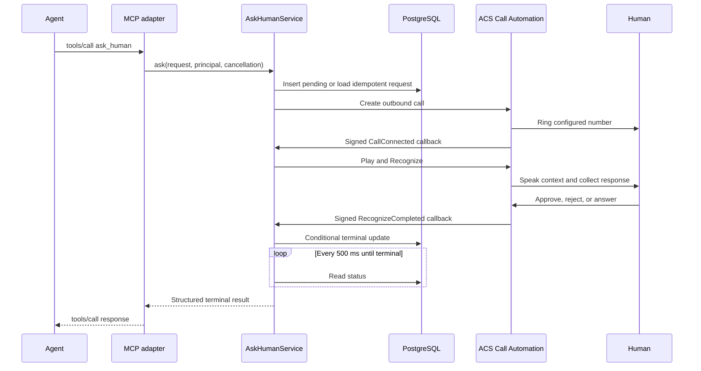

<!-- markdownlint-disable-file -->
# Task Research: AskMyHuman Tight MVP Scope

AskMyHuman should prove one narrow product promise: an autonomous agent can synchronously call one designated human, ask for approval or one spoken answer, and receive a terminal result within the same invocation.

## Task Implementation Requests

* Preserve the product goal and explicit MVP limits in README.md.
* Select the smallest supported Azure architecture that can ship quickly.
* Define the agent contract, request lifecycle, persistence, security, and observability needed for a credible demonstration.
* Keep multi-human routing, retries, escalation, extra channels, asynchronous resume, and generalized platform abstractions out of the MVP.

## Scope and Success Criteria

* Scope: One authenticated agent request, one secret-configured phone owner, one outbound call attempt, one spoken prompt, one approval decision or free-form answer, and one synchronous terminal response.
* Assumptions:
  * Azure is the required deployment platform.
  * `MY_MOBILE_NUMBER` identifies the only destination and cannot be overridden by a caller.
  * "Voice based" means one spoken prompt-response exchange in the tight MVP, not an open-ended LLM conversation.
  * PostgreSQL remains in the stack because README.md explicitly names it and it provides callback correlation and idempotency.
  * The agent-facing MCP operation can wait at least 225 seconds.
* Success Criteria:
  * An agent submits either `approval` or `input` and receives a stable structured result.
  * The configured human receives enough context to approve, reject, or answer.
  * Every accepted request ends exactly once as `responded` or `expired` within 210 seconds.
  * Duplicate agent requests and duplicate ACS callbacks do not place duplicate calls or overwrite a terminal result.
  * Phone numbers, prompts, answers, tokens, and callback bodies do not enter telemetry.
  * The architecture can later replace Play-and-Recognize with a Voice Live relay without changing the public contract.

## Selected Approach

Build one Python Azure Container App containing an authoritative HTTP application service, a thin in-process MCP adapter, and an Azure Communication Services (ACS) callback endpoint. Use ACS Call Automation `Play` plus `Recognize` with a connected Azure AI multi-service resource. Store request coordination in one PostgreSQL table and emit content-free telemetry through Azure Monitor OpenTelemetry to Application Insights.

This is the fastest supported path that meets both response modes:

* Approval uses recognition choices with fixed `approve` and `reject` labels. DTMF can provide a fallback.
* Input uses speech recognition and returns `speechResult.speech` as the answer.
* ACS and Azure Speech own call audio, text-to-speech, and speech-to-text. The application does not host a media WebSocket or process PCM audio.

The MVP is deliberately a bounded prompt-response interaction. If natural multi-turn clarification by an LLM is mandatory, the selected voice approach is insufficient and the project must accept the larger ACS-to-Voice-Live relay described under alternatives.

## Recommended Architecture

```text
Agent
  -> MCP Streamable HTTP /mcp
  -> thin ask_human adapter
  -> AskHumanService
       -> PostgreSQL human_requests
       -> ACS Call Automation outbound call
            -> configured human phone
            -> Azure AI Play + Recognize

ACS signed callbacks
  -> POST /v1/callbacks/acs
  -> AskHumanService conditional terminal update
  -> waiting MCP invocation returns structured result
```

One Container App exposes three boundaries:

* `POST /v1/requests`: authoritative synchronous HTTP JSON contract
* `/mcp`: Streamable HTTP endpoint exposing one `ask_human` tool
* `POST /v1/callbacks/acs`: ACS event receiver with ACS JWT validation

The HTTP and MCP handlers invoke the same in-process `AskHumanService`; the MCP adapter must not call the HTTP route over the network. Set Container Apps minimum replicas to one so cold start does not consume the call deadline.

### Sequence Flow



## Public Contract

The HTTP request body and MCP tool arguments are identical. Destination, callback URL, deadline, voice, and locale are deployment configuration, not caller inputs.

### Request

```json
{
  "kind": "approval",
  "prompt": "Deploy release 2026.09.15 to production?",
  "idempotencyKey": "eb1b2a60-adcd-4fa8-a45e-91eb15fae6a4"
}
```

Rules:

* `kind` is `approval` or `input`.
* `prompt` is nonblank and at most 2,000 characters after trimming.
* `idempotencyKey` is a caller-generated UUID.
* Unknown properties are rejected.

### Responded Results

```json
{
  "requestId": "1a7241d5-ed74-4c80-88a1-2805905ae6f5",
  "status": "responded",
  "outcome": "approved"
}
```

```json
{
  "requestId": "1a7241d5-ed74-4c80-88a1-2805905ae6f5",
  "status": "responded",
  "outcome": "answered",
  "answer": "Use the blue deployment slot."
}
```

Valid responded outcomes are `approved`, `rejected`, and `answered`. Only `answered` includes the nonblank `answer` field.

### Expired Result

```json
{
  "requestId": "1a7241d5-ed74-4c80-88a1-2805905ae6f5",
  "status": "expired",
  "outcome": "no_answer"
}
```

Valid expired outcomes are `no_answer`, `busy`, `declined`, `disconnected`, `cancelled`, and `deadline_exceeded`. `pending` is internal state and is never returned by the synchronous operation.

Human availability outcomes are valid results, not service errors. Validation, authorization, idempotency conflict, rate limiting, dependency failure, and internal failure use a separate error object with `requestId`, `code`, `message`, and `retryable`.

## State, Deadline, and Idempotency

Use one non-extendable 210-second deadline starting when the pending row is committed. Azure Container Apps has a fixed 240-second HTTP ingress timeout. Configure clients for at least 225 seconds, stop new media work at 205 seconds, persist `expired/deadline_exceeded`, and reserve five seconds for cleanup and response serialization. MCP progress events must not extend the product deadline.

State mapping:

| Event | Status | Outcome |
|---|---|---|
| Approval choice `approve` | `responded` | `approved` |
| Approval choice `reject` | `responded` | `rejected` |
| Nonblank speech result | `responded` | `answered` |
| Initial silence or unmatched choice | `expired` | `no_answer` |
| Machine-readable busy result | `expired` | `busy` |
| Machine-readable phone decline | `expired` | `declined` |
| Disconnect before response | `expired` | `disconnected` |
| Initiating client cancellation | `expired` | `cancelled` |
| 205-second work cutoff | `expired` | `deadline_exceeded` |

Every callback performs a conditional update only when the row is pending and unexpired. The first terminal update wins; authenticated duplicate or late callbacks return HTTP 200 and make no state change.

Scope each idempotency key by authenticated agent subject. Hash the normalized request. For an existing key:

* Different hash returns `idempotency_conflict`.
* Matching terminal request replays its result or error.
* Matching pending request joins the existing wait without placing another call.

Permit only one globally pending request in the MVP. A distinct request during a call returns 429. This matches the one-human design and provides a direct cost and nuisance-call safeguard.

## Persistence

Use one PostgreSQL table:

```sql
CREATE TABLE human_requests (
    request_id uuid PRIMARY KEY,
    subject_id text NOT NULL,
    idempotency_key text NOT NULL,
    request_hash char(64) NOT NULL,
    kind text NOT NULL CHECK (kind IN ('approval', 'input')),
    prompt text NOT NULL,
    status text NOT NULL CHECK (status IN ('pending', 'responded', 'expired')),
    outcome text,
    answer text,
    error_code text,
    acs_call_connection_id text,
    created_at timestamptz NOT NULL,
    expires_at timestamptz NOT NULL,
    completed_at timestamptz,
    UNIQUE (subject_id, idempotency_key)
);
```

Use `INSERT ... ON CONFLICT` for atomic idempotency and `UPDATE ... WHERE status = 'pending'` for terminal arbitration. Poll the row every 500 milliseconds while the request waits; this is simpler than adding Redis, a queue, or `LISTEN/NOTIFY` at MVP volume.

Delete terminal rows after 24 hours. Store no audio, intermediate recognition hypotheses, or full transcript. The prompt and final answer exist only for callback execution and short-lived replay.

## Security and Observability

* Protect `/mcp` and `/v1/requests` with Container Apps Microsoft Entra authentication.
* Require one `AskHuman.Invoke` application role and an allowlist of agent application IDs.
* Prefer managed or workload identity to client secrets.
* Validate every ACS callback JWT against the ACS OpenID configuration, signature, issuer, expiration, and configured ACS resource audience.
* Load `MY_MOBILE_NUMBER` from a Container Apps secret, require E.164 format at startup, and fail readiness when invalid.
* Never accept a destination number, callback URL, ACS resource, voice, or locale from the caller.
* Do not log request or response bodies.

Emit content-free spans for request, PostgreSQL, ACS call creation, callback, and recognition. Emit request count, duration, dependency failure count, and a zero-or-one pending gauge. Allowed attributes are random request ID, kind, terminal status/outcome, duration, ACS event type and numeric code, and replay flag.

Do not emit phone number, prompt, answer, recognized phrase, raw callback, idempotency key, authorization data, JWT claims, or connection strings. Use 30-day Application Insights retention and 24-hour PostgreSQL payload retention.

## Technical Scenarios and Alternatives

### Selected: ACS Play and Recognize

Advantages:

* Directly supports choices and free-form speech.
* Uses ordinary HTTPS commands and CloudEvent callbacks.
* Requires no audio codecs, WebSocket server, buffering, resampling, voice session, or barge-in handling.
* Has an official Python outbound-call sample close to the required workflow.

Limitations:

* One prompt-response exchange, not an LLM-led conversation.
* Cannot semantically clarify an ambiguous answer.
* Recognition can produce silence, no-match, or imperfect transcription; the tight MVP intentionally adds no retry.

Recommendation: Use this option for the first shipped proof of concept.

### Rejected for MVP: ACS Media Streaming to Voice Live

This option supports natural multi-turn conversation, interruption, semantic turn detection, transcripts, and function calling. It is necessary only when the human must ask questions or the system must clarify answers.

It requires three concurrent surfaces: ACS call-control callbacks, an application-hosted ACS media WebSocket, and a separately authenticated Voice Live WebSocket. The relay must translate envelopes, base64 PCM16 audio, session events, buffering, interruption, and cleanup. ACS supports 16-bit mono PCM at 16 or 24 kHz; using 24 kHz on both sides avoids normal resampling but does not remove protocol translation.

Microsoft's official Call Center Voice Agent Accelerator implements this custom relay. No documented native Voice Live PSTN number, SIP endpoint, or direct ACS service attachment exists. Reject this option because it adds material implementation and operational risk without being needed for one decision or answer.

### Rejected: Native Voice Live Telephony

No supported public native integration was found. Microsoft's Voice Live telephony guidance points to ACS or third-party connectors plus application integration. Keep this off the implementation shortlist unless Microsoft supplies a documented supported capability.

### Rejected: MCP-First Domain Architecture

MCP supports the desired waiting tool call, structured output, and Streamable HTTP, but it does not own ACS callbacks or durable state. Making JSON-RPC lifecycle rules the domain boundary would couple telephony orchestration and tests to one agent protocol. Use a thin MCP adapter over a protocol-neutral service instead.

### Rejected: In-Memory or Table Persistence

In-memory state fails when Container Apps restarts or routes an ACS callback to another replica. Table Storage is durable but introduces partition keys, ETags, and conditional-update handling while contradicting the README's named PostgreSQL stack. PostgreSQL already provides the needed unique constraint and first-writer-wins update with no demonstrated delivery penalty.

## Implementation Sequence

### Verified Implementation Layout

Use Python 3.12 with uv, FastAPI, the MCP Python SDK 2.x, Psycopg 3 async
pooling, Alembic, and PostgreSQL 16. Use the asynchronous ACS Call Automation
client, Azure Identity, Azure Monitor OpenTelemetry, PyJWT, and HTTPX. Validate
with pytest, testcontainers, Ruff, strict mypy, JSON Schema checks, Docker, and
Bicep builds.

Parallel implementation starts only after one foundation owner freezes package
metadata, configuration names, JSON Schemas, domain models, application ports,
and test fakes. Persistence, core orchestration, telephony, security, HTTP, MCP,
observability, and four infrastructure module slices can then proceed with
disjoint file ownership. Designated integrators exclusively own application
composition, Bicep composition, dependency lock regeneration, shared fixtures,
image and CI files, and the final README update.

The exact repository tree, workstream ownership, dependency graph, scoped test
commands, merge risks, and infrastructure module contracts are verified in
`.copilot-tracking/research/subagents/2026-09-15/parallel-implementation-layout-research.md`.

1. Define checked-in request, result, and error JSON Schemas plus contract tests.
2. Implement the PostgreSQL migration, idempotent insert, conditional terminal update, expiry, replay waiter, and 24-hour purge.
3. Implement `AskHumanService` and `POST /v1/requests` with a fake call driver; prove all states, cancellation, and the 210-second deadline without paid calls.
4. Add Entra role authorization, one-pending admission control, and body-log suppression.
5. Implement the ACS callback endpoint with JWT validation and callback race tests.
6. Adapt the official Python outbound-call sample for one call, one Play-and-Recognize action, one acknowledgement, and hang-up.
7. Add the thin `/mcp` Streamable HTTP adapter and reuse the same schemas.
8. Add redacted OpenTelemetry spans and low-cardinality metrics.
9. Provision Container Apps, PostgreSQL Flexible Server, ACS, Azure AI multi-service, and Application Insights.
10. Run real calls for approve, reject, free-form answer, silence, no-answer, busy, decline where exposed, disconnect, client cancellation, and forced deadline.

Do not add a queue, cache, event bus, workflow engine, provider framework, UI, dashboard, retry, fallback channel, or contact model.

## Evidence Log

### Repository Evidence

* README.md:2-4 defines the universal human-help goal and proof-of-concept context.
* README.md:6-10 defines approval/input, probable MCP access, one `MY_MOBILE_NUMBER`, phone-only contact, spoken context, and voice response.
* README.md:11-13 defines pending/responded/expired, synchronous operation, no resume, and explicit future exclusions.
* README.md:14-15 defines the complete agent-to-human-to-agent flow.
* README.md:17-23 names Container Apps, PostgreSQL, ACS, Voice Live, and Application Insights.
* .gitignore:1-52 and .gitignore:85-128 indicate likely Python intent but no selected runtime or framework.
* The repository contains no implementation, test, dependency, infrastructure, or CI files as of 2026-09-15.

### Authoritative External Sources

* [ACS Call Automation overview](https://learn.microsoft.com/azure/communication-services/concepts/call-automation/call-automation): outbound calls, Play, and Recognize capabilities.
* [Gather user input with Recognize](https://learn.microsoft.com/azure/communication-services/how-tos/call-automation/recognize-action): choices, speech, result events, and recognition limits.
* [Connect ACS with Foundry Tools](https://learn.microsoft.com/azure/communication-services/concepts/call-automation/azure-communication-services-azure-cognitive-services-integration): managed speech integration without customer-managed media.
* [Outbound Call Automation quickstart](https://learn.microsoft.com/azure/communication-services/quickstarts/call-automation/quickstart-make-an-outbound-call): ACS number and callback prerequisites.
* [Official Python outbound sample](https://github.com/Azure-Samples/communication-services-python-quickstarts/blob/052a2dca2f369631ed353a7d0cff9e4aec339280/callautomation-outboundcalling/main.py): outbound approval-style flow.
* [ACS audio streaming](https://learn.microsoft.com/azure/communication-services/concepts/call-automation/audio-streaming-concept): WebSocket PCM framing for the rejected relay option.
* [Voice Live telephony accelerator](https://learn.microsoft.com/azure/ai-services/speech-service/voice-live-telephony): documented application integration pattern.
* [Official call-center accelerator](https://github.com/Azure-Samples/call-center-voice-agent-accelerator/tree/162cef590787b3bcc0a051608a7981f2a01daf41): proof that ACS-to-Voice-Live requires an application relay.
* [MCP tools specification](https://modelcontextprotocol.io/specification/2026-07-28/server/tools): tool schemas and structured output.
* [MCP Streamable HTTP transport](https://modelcontextprotocol.io/specification/2026-07-28/basic/transports): one waiting remote HTTP tool invocation.
* [MCP cancellation and timeouts](https://modelcontextprotocol.io/specification/2026-07-28/basic/patterns/cancellation): configurable sender timeout and cancellation behavior.
* [Container Apps ingress](https://learn.microsoft.com/azure/container-apps/ingress-overview): fixed 240-second request timeout.
* [PostgreSQL `INSERT ... ON CONFLICT`](https://www.postgresql.org/docs/current/sql-insert.html): atomic idempotent insertion.
* [Secure a Call Automation webhook](https://learn.microsoft.com/azure/communication-services/how-tos/call-automation/secure-webhook-endpoint): ACS callback JWT validation.

### Detailed Research Artifacts

* .copilot-tracking/research/subagents/2026-09-15/repository-scope-research.md
* .copilot-tracking/research/subagents/2026-09-15/voice-options-decision-research.md
* .copilot-tracking/research/subagents/2026-09-15/service-contract-decision-research.md
* .copilot-tracking/research/subagents/2026-09-15/parallel-implementation-layout-research.md

## Risks and Unresolved Deployment Inputs

* Confirm that the owner's country and Azure subscription can acquire an outbound-enabled ACS number. Availability depends on number type, regulatory rules, billing address, and subscription eligibility.
* Confirm that the chosen MCP client supports a request timeout of at least 225 seconds and handles Streamable HTTP cancellation.
* Identify the Microsoft Entra tenant, authorized agent application IDs, and managed identities.
* Approve 24-hour encrypted request retention and 30-day content-free telemetry retention.
* Accept that carrier result details may not always distinguish phone decline from generic disconnect.
* Choose one canonical product/code name; the repository says both AskMyHuman and AskHuman.

These inputs affect deployment configuration, not the selected architecture. No further architecture research is required before implementation.
