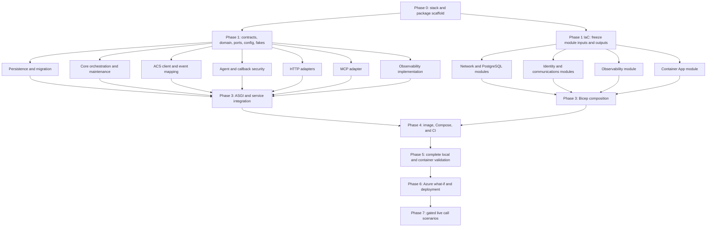

<!-- markdownlint-disable MD013 -->

## Research Status

Complete as of 2026-09-15. The repository, primary scope decision, three cited
detailed reports, current package metadata, tagged SDK documentation, and
relevant Azure deployment guidance were reviewed. No product code was created.

## Research Questions

* Which conservative Python version and package-management approach fit all selected runtime and development dependencies?
* Which web framework, MCP SDK integration, PostgreSQL driver and migration tool, Azure SDKs, testing tools, lint tools, and type checker should the tight MVP use?
* Which Docker and Bicep layouts preserve one deployable Azure Container App while keeping infrastructure reviewable?
* What exact product, test, configuration, and infrastructure paths should implementation create?
* Which contracts and foundations must land before parallel implementation begins?
* Which files can have independent owners, and which shared integration files are merge hotspots?
* What phase dependency graph lets multiple developers proceed without inventing conflicting contracts?
* Which scoped validation commands should each workstream run, and what constitutes final validation?

## Executive Decision

Use Python 3.12, uv with a committed lockfile, FastAPI on Uvicorn, the official
MCP Python SDK 2.x, Psycopg 3 async pooling, Alembic, and PostgreSQL 16. Use the
async Azure Communication Services (ACS) Call Automation client,
`DefaultAzureCredential`, Azure Monitor OpenTelemetry, PyJWT with its
cryptography extra, and HTTPX. Use pytest, pytest-asyncio, testcontainers,
JSON Schema validation, pytest-cov, Ruff, and mypy for development validation.

Build one Linux `amd64` image from `python:3.12-slim-bookworm`. One Uvicorn
process with one worker hosts the FastAPI routes and a mounted MCP Streamable
HTTP Starlette application. The same image runs the single Alembic upgrade
before Uvicorn starts. Azure Container Apps runs exactly one minimum and one
maximum replica for the tight MVP. PostgreSQL remains durable coordination for
restart safety; no process-local waiter is authoritative.

Provision infrastructure with one resource-group-scoped Bicep entry point and
small modules for identity, network, observability, PostgreSQL, communications,
and the Container App. Use a private PostgreSQL subnet and private DNS. Keep the
ACS phone number, Microsoft Entra application registration, image registry, and
tenant-specific identifiers as deployment inputs because ordinary ARM Bicep
cannot acquire or govern all of them.

This plan retains one deployable Container App. It adds no worker, Container
Apps job, sidecar, queue, cache, event bus, provider framework, retry path, UI,
or Voice Live media relay.

## Governing Constraints

* One Python process in one Azure Container App hosts the HTTP API, Streamable HTTP MCP endpoint, ACS callback endpoint, orchestration, expiry, and purge work.
* PostgreSQL is the only coordination store.
* ACS Call Automation Play and Recognize provides one outbound phone attempt and one spoken approval or free-form answer.
* The public request and result contracts, 210-second deadline, one globally pending request, short retention, and telemetry redaction follow the completed scope research.
* Provider frameworks, queues, caches, UIs, retries, fallback channels, media streaming, Voice Live relay code, and generalized routing remain excluded.

The architecture uses one narrow `CallAutomationGateway` protocol so the core
service can be tested without paid phone calls. It has one production
implementation, the ACS adapter, and one test fake. It is not a provider
registry, plug-in mechanism, or generalized telephony abstraction.

## Selected Stack

### Runtime And Package Management

Select Python 3.12 and declare `requires-python = ">=3.12,<3.13"`. Python 3.10
is the common package floor, but it is older than necessary for a new service.
Python 3.13 and 3.14 offer no MVP capability that offsets their shorter field
history. Python 3.12 supports standard `asyncio` cancellation and task groups,
has mature binary wheels, and is supported by every selected package.

Use uv 0.12 with `pyproject.toml` and a committed `uv.lock`. The project manifest
uses compatible major-version bounds, while `uv.lock` records the exact complete
resolution used by local development, CI, and the container build. Use Hatchling
as the PEP 517 build backend for the `src` package layout. Do not add Poetry,
Pipenv, requirements-file compilation, tox, or a second Python package manager.

The official `python:3.12-slim-bookworm` image existed on 2026-09-15 with
multi-architecture digest
`sha256:782412e85d0f0984994c290652577d4018aff08145c85b262bb63dc0c7522254`.
Pin that digest when the Dockerfile lands and update it deliberately through a
reviewed dependency change. Copy uv 0.12.14 from its official versioned image,
sync with `--frozen --no-dev --no-editable`, and run Uvicorn with one worker.

### Web And MCP Composition

Use FastAPI 0.141 as the HTTP host and Uvicorn 0.53 as its ASGI server. FastAPI
gives typed Pydantic request handling, application lifespan ownership, explicit
HTTP error mapping, and HTTPX-compatible tests. Do not enable Swagger UI in the
deployed configuration because the MVP has no human UI and the API accepts
sensitive prompts.

Use the official `mcp` 2.2 package and `MCPServer`. Its documented
`streamable_http_app()` returns a Starlette application with `/mcp` and creates a
session manager. Mounting that app suppresses the mounted lifespan, so the
FastAPI host lifespan must enter `mcp.session_manager.run()`. Build the MCP app
before the lifespan accesses the manager. Register all FastAPI routes first and
mount the MCP application at `/` last, preserving the exact public `/mcp` path
without letting the catch-all mount hide `/v1`, health, or OAuth metadata routes.

Configure MCP transport security with the deployed Container App hostname.
There is no browser client, so do not add CORS. Container Apps Microsoft Entra
authentication protects `/mcp` and `/v1/requests`; application code still checks
the required role and client application allowlist. The MCP adapter calls
`AskHumanService` directly and never loops back through HTTP.

### PostgreSQL And Migrations

Use Azure Database for PostgreSQL Flexible Server 16. The current Azure support
matrix includes version 16, and it is a conservative server major for a new MVP.
Use `psycopg[binary,pool]` 3.3 for application access. Create an
`AsyncConnectionPool` with `open=False`, open it explicitly in the host
lifespan, call `wait()` during readiness startup, and close it during shutdown.
Repository code uses parameterized SQL directly because the state machine needs
specific `INSERT ... ON CONFLICT` and conditional `UPDATE` statements and gains
nothing from an ORM model.

Use Alembic 1.20 with SQLAlchemy 2.0 only as the migration runtime. The Alembic
environment uses the synchronous `postgresql+psycopg` dialect before Uvicorn
starts. Application requests remain fully async. The first migration creates the
`human_requests` table, its `(subject_id, idempotency_key)` uniqueness contract,
and a partial unique index that permits only one row whose status is `pending`.
The database, not a preflight count, arbitrates concurrent admission.

### Azure And Security SDKs

Use these direct integrations:

* `azure-communication-callautomation` 1.6 through
 `azure.communication.callautomation.aio.CallAutomationClient` for call
 creation, Play and Recognize, acknowledgement, and hang-up
* `azure-identity` 1.25 through async `DefaultAzureCredential` for local Azure
 CLI credentials and deployed managed identity
* `azure-monitor-opentelemetry` 1.8 for Application Insights export and standard
 FastAPI and HTTPX instrumentation
* `opentelemetry-api` 1.44 as a direct dependency because application code emits
 custom content-free spans and metrics
* `PyJWT[crypto]` 2.14 for ACS callback signature, issuer, audience, expiry, and
 key validation
* HTTPX 0.28 for async OpenID configuration and JSON Web Key Set retrieval with
 bounded in-memory metadata caching

The ACS 1.6 SDK has an async client but no public callback parser in its exported
surface. Parse the small CloudEvent JSON envelope into strict Pydantic event
models in `telephony/events.py`; do not import generated or private Azure SDK
modules. No direct Foundry or Voice Live SDK belongs in this MVP because ACS Play
and Recognize only needs the configured Azure AI multi-service endpoint.

The Azure Monitor distribution currently includes Psycopg 2 instrumentation,
not Psycopg 3 instrumentation. Keep explicit repository spans rather than adding
the wrong auto-instrumentor. Never attach SQL parameters, prompt text, answers,
phone numbers, callback bodies, tokens, or idempotency keys to spans or logs.

### Test And Static Analysis Stack

Use pytest 9.1, pytest-asyncio 1.4, pytest-cov 7.1, JSON Schema 4.26,
testcontainers 4.15 with its PostgreSQL extra, and cryptography 50 for generated
test signing keys. Unit tests inject fake repository, call gateway, clock, and
telemetry ports. PostgreSQL integration tests start PostgreSQL 16 in a disposable
container and run Alembic before repository tests. HTTP and MCP integration tests
use the composed ASGI application; live Azure calls remain explicitly marked and
are never part of the default test run.

Use Ruff 0.16 for formatting, imports, and linting. Use mypy 2.3 in strict mode
for `src` and tests. Keep pytest, Ruff, mypy, and coverage configuration in
`pyproject.toml` to avoid extra shared configuration files.

### Dependency Declaration

Use these compatible ranges in `pyproject.toml`; the committed lockfile supplies
exact pins:

```toml
[project]
requires-python = ">=3.12,<3.13"
dependencies = [
 "alembic>=1.20,<2",
 "azure-communication-callautomation>=1.6,<2",
 "azure-identity>=1.25,<2",
 "azure-monitor-opentelemetry>=1.8,<2",
 "fastapi>=0.141,<1",
 "httpx>=0.28,<1",
 "mcp>=2.2,<3",
 "opentelemetry-api>=1.44,<2",
 "psycopg[binary,pool]>=3.3,<4",
 "pydantic>=2.12,<3",
 "pydantic-settings>=2.15,<3",
 "PyJWT[crypto]>=2.14,<3",
 "sqlalchemy>=2.0,<3",
 "uvicorn>=0.53,<1",
]

[build-system]
requires = ["hatchling>=1.32,<2"]
build-backend = "hatchling.build"

[dependency-groups]
dev = [
 "cryptography>=50,<51",
 "jsonschema[format]>=4.26,<5",
 "mcp[cli]>=2.2,<3",
 "mypy>=2.3,<3",
 "pytest>=9.1,<10",
 "pytest-asyncio>=1.4,<2",
 "pytest-cov>=7.1,<8",
 "ruff>=0.16,<1",
 "testcontainers[postgres]>=4.15,<5",
]
```

### Compatibility Evidence

PyPI metadata returned these current releases and Python floors on 2026-09-15:

| Package                              | Release | Declared Python floor |
|--------------------------------------|---------|-----------------------|
| `mcp`                                | 2.2.0   | 3.10                  |
| `fastapi`                            | 0.141.1 | 3.10                  |
| `uvicorn`                            | 0.53.0  | 3.10                  |
| `pydantic-settings`                  | 2.15.0  | 3.10                  |
| `psycopg`                            | 3.3.5   | 3.10                  |
| `psycopg-pool`                       | 3.3.1   | 3.10                  |
| `alembic`                            | 1.20.0  | 3.10                  |
| `sqlalchemy`                         | 2.0.53  | 3.7                   |
| `azure-communication-callautomation` | 1.6.0   | 3.9                   |
| `azure-identity`                     | 1.25.3  | 3.9                   |
| `azure-monitor-opentelemetry`        | 1.8.10  | 3.8                   |
| `opentelemetry-api`                  | 1.44.0  | 3.10                  |
| `PyJWT`                              | 2.14.0  | 3.9                   |
| `httpx`                              | 0.28.1  | 3.8                   |
| `pytest`                             | 9.1.1   | 3.10                  |
| `testcontainers`                     | 4.15.0  | 3.10                  |
| `ruff`                               | 0.16.7  | 3.7                   |
| `mypy`                               | 2.3.1   | 3.10                  |
| `uv`                                 | 0.12.14 | 3.8                   |

MCP 2.2 declares Starlette 0.27 or newer on Python versions below 3.14 and
Pydantic 2.12 or newer. FastAPI 0.141 declares Starlette 0.46 or newer and
Pydantic 2.9 or newer. Their constraints intersect cleanly on Python 3.12.

## Application Boundaries

The package has six ownership boundaries:

1. Domain and contracts own validated public data, internal states, terminal
  transitions, and stable application errors. They import no framework, Azure,
  PostgreSQL, or telemetry implementation.
2. Application owns orchestration, idempotent admission, creator versus replay
  waiter cancellation, the 205-second work cutoff, the 210-second deadline, and
  maintenance. It depends only on domain types and narrow ports.
3. Persistence owns Psycopg, SQL, row mapping, database arbitration, polling,
  stale-pending expiry, and 24-hour purge.
4. Telephony owns the ACS SDK, strict callback event parsing, documented result
  code mapping, and call-control commands. It does not decide database state.
5. Security owns trusted Container Apps principal parsing and ACS callback JWT
  validation. The HTTP adapters apply these checks before application calls.
6. API and MCP are thin inbound adapters. Observability implements a port and
  ASGI instrumentation without owning business behavior.

The foundational port contract should expose these operations before parallel
work starts:

* `RequestRepository.create_or_replay()` returns whether the caller created the
 durable row, joined a matching pending row, found a terminal replay, hit an
 idempotency conflict, or lost the one-pending admission race.
* `RequestRepository.attach_call_id()`, `get()`, `complete_if_pending()`,
 `expire_stale()`, and `purge_terminal()` are the only persistence operations.
* `CallAutomationGateway.create_call()`, `start_recognition()`,
 `acknowledge_and_hang_up()`, and `hang_up()` are the only call-control
 operations.
* `Clock.now()` and `Clock.sleep()` make deadlines and 500-millisecond polling
 deterministic in unit tests.
* `Telemetry` accepts only enumerated kind, status, outcome, operation, numeric
 ACS code, elapsed time, replay flag, and random request ID fields.

`AskHumanService.ask()` is the single synchronous use case called by HTTP and
MCP. `AskHumanService.handle_call_event()` is the single callback use case.
Only the invocation that inserted the row may translate its cancellation into a
terminal `cancelled` result. Cancelling a joined replay waiter ends that wait but
does not hang up the shared call.

## Exact Planned Repository Layout

The implementation should create exactly this initial product and configuration
tree. Additional files require an architecture or ownership update because they
can silently create a new shared surface.

```text
.dockerignore
.env.example
.github/workflows/ci.yml
.python-version
Dockerfile
alembic.ini
compose.yaml
pyproject.toml
uv.lock
migrations/env.py
migrations/script.py.mako
migrations/versions/20260915_0001_create_human_requests.py
schemas/ask-human-error.schema.json
schemas/ask-human-request.schema.json
schemas/ask-human-result.schema.json
scripts/export_schemas.py
src/ask_my_human/__init__.py
src/ask_my_human/main.py
src/ask_my_human/config.py
src/ask_my_human/contracts.py
src/ask_my_human/errors.py
src/ask_my_human/observability.py
src/ask_my_human/domain/__init__.py
src/ask_my_human/domain/models.py
src/ask_my_human/domain/transitions.py
src/ask_my_human/application/__init__.py
src/ask_my_human/application/ports.py
src/ask_my_human/application/service.py
src/ask_my_human/application/maintenance.py
src/ask_my_human/persistence/__init__.py
src/ask_my_human/persistence/pool.py
src/ask_my_human/persistence/repository.py
src/ask_my_human/telephony/__init__.py
src/ask_my_human/telephony/acs_client.py
src/ask_my_human/telephony/events.py
src/ask_my_human/security/__init__.py
src/ask_my_human/security/agent.py
src/ask_my_human/security/acs_callback.py
src/ask_my_human/api/__init__.py
src/ask_my_human/api/requests.py
src/ask_my_human/api/callbacks.py
src/ask_my_human/api/health.py
src/ask_my_human/api/oauth_metadata.py
src/ask_my_human/mcp_adapter/__init__.py
src/ask_my_human/mcp_adapter/server.py
```

The implementation should create exactly this initial test tree:

```text
tests/conftest.py
tests/support/__init__.py
tests/support/fakes.py
tests/contract/test_json_schemas.py
tests/unit/test_config.py
tests/unit/test_observability.py
tests/unit/domain/test_transitions.py
tests/unit/application/test_service.py
tests/unit/application/test_maintenance.py
tests/unit/telephony/test_acs_client.py
tests/unit/telephony/test_events.py
tests/unit/security/test_agent.py
tests/unit/security/test_acs_callback.py
tests/unit/api/test_requests.py
tests/unit/api/test_callbacks.py
tests/unit/api/test_health.py
tests/unit/api/test_oauth_metadata.py
tests/unit/mcp_adapter/test_server.py
tests/integration/conftest.py
tests/integration/test_asgi_app.py
tests/integration/persistence/test_migrations.py
tests/integration/persistence/test_repository.py
tests/e2e/test_live_call.py
tests/fixtures/acs/call-connected.json
tests/fixtures/acs/call-disconnected.json
tests/fixtures/acs/create-call-failed.json
tests/fixtures/acs/recognize-choice-completed.json
tests/fixtures/acs/recognize-failed.json
tests/fixtures/acs/recognize-speech-completed.json
```

The implementation should create exactly this infrastructure tree:

```text
infra/main.bicep
infra/environments/dev.bicepparam
infra/modules/identity.bicep
infra/modules/network.bicep
infra/modules/observability.bicep
infra/modules/postgresql.bicep
infra/modules/communications.bicep
infra/modules/container-app.bicep
```

Update the existing `README.md` after behavior and deployment commands are
validated. Update the existing `.gitignore` only if implementation produces an
uncovered local artifact. Do not create a second architecture document, API
client package, generated OpenAPI client, Helm chart, Terraform tree, Kubernetes
manifest, frontend tree, worker package, or provider package.

## Bicep Infrastructure Layout

`infra/main.bicep` is resource-group scoped and is the only module composition
file. Its modules have these responsibilities:

* `identity.bicep` creates one user-assigned managed identity for the Container
 App and returns its resource ID, principal ID, and client ID.
* `network.bicep` creates one virtual network, one Container Apps infrastructure
 subnet, one delegated PostgreSQL subnet, and the PostgreSQL private DNS zone.
* `observability.bicep` creates one Log Analytics workspace and one Application
 Insights resource and returns content-free connection settings.
* `postgresql.bicep` creates PostgreSQL Flexible Server 16 on the delegated
 subnet, one application database, private DNS linkage, TLS-only access, and a
 Burstable development SKU. It never outputs a password or complete DSN.
* `communications.bicep` creates ACS with managed identity, the Azure AI
 multi-service resource used by Play and Recognize, and the minimum role
 assignments between ACS, AI, and the Container App identity. It returns only
 endpoints and resource IDs.
* `container-app.bicep` creates one VNet-integrated Container Apps environment,
 one external-ingress Container App, secret references, probes, Microsoft
 Entra `authConfig`, and the callback exclusion. It sets port 8000, one active
 revision, `minReplicas: 1`, and `maxReplicas: 1`.

`infra/environments/dev.bicepparam` uses `using '../main.bicep'` and
`readEnvironmentVariable()` for tenant-specific and secret inputs. It commits no
phone number, password, client secret, application ID, subscription ID, or image
credential. The required deployment environment variables are:

* `AZURE_LOCATION`
* `CONTAINER_IMAGE`
* `CONTAINER_REGISTRY_SERVER`
* `CONTAINER_REGISTRY_RESOURCE_ID`
* `POSTGRES_ADMIN_PASSWORD`
* `MY_MOBILE_NUMBER`
* `ACS_SOURCE_PHONE_NUMBER`
* `ENTRA_TENANT_ID`
* `ENTRA_CLIENT_ID`
* `ENTRA_CLIENT_SECRET`
* `AUTHORIZED_AGENT_APP_IDS`

The Container App receives fixed configuration for the 210-second deadline,
205-second work cutoff, 500-millisecond poll, 24-hour row retention, voice,
locale, callback audience, ACS endpoint, Azure AI endpoint, database host, and
MCP host allowlist. Only secrets use Container Apps secret references. The
Application Insights connection string is configuration but must still stay out
of logs.

Do not provision a registry in this MVP. Accept a content-addressed image from an
existing Azure Container Registry and grant the managed identity `AcrPull` when
the deployment identity can assign it. This avoids making image-registry
governance part of the product architecture.

## Parallel Workstreams

### Phase Zero Foundation

One foundation owner lands the stack and contract baseline before feature
branches diverge:

* `pyproject.toml`, `uv.lock`, `.python-version`, package directories, and empty
 `__init__.py` files
* `config.py` with final setting names, types, defaults, and startup validation
* `contracts.py`, `errors.py`, all three JSON Schemas, and the schema export check
* `domain/models.py` and `domain/transitions.py`
* `application/ports.py` with the exact narrow interfaces listed above
* `tests/support/fakes.py`, which implements those ports without network access
* Test markers, strict mypy settings, Ruff settings, and coverage settings

The cheap disconfirming check for this phase is that contract, domain, and config
tests pass without importing FastAPI, MCP, Psycopg, or any Azure package from the
domain modules.

### Independently Owned Work

After Phase Zero, these workstreams can own disjoint files:

| Workstream | Independent ownership |
| ------------ | ----------------------- |
| Persistence | `migrations/**`, `alembic.ini`, `persistence/**`, `tests/integration/persistence/**`, and integration PostgreSQL fixtures |
| Core orchestration | `application/service.py`, `application/maintenance.py`, and `tests/unit/application/**` |
| ACS telephony | `telephony/**`, ACS JSON fixtures, and `tests/unit/telephony/**` |
| Security | `security/**` and `tests/unit/security/**` |
| HTTP API | `api/requests.py`, `api/callbacks.py`, their focused tests, and error-to-HTTP mapping |
| Health and metadata | `api/health.py`, `api/oauth_metadata.py`, and their focused tests |
| MCP adapter | `mcp_adapter/**` and `tests/unit/mcp_adapter/**` |
| Observability | `observability.py` and `tests/unit/test_observability.py` |
| Network and database IaC | `infra/modules/network.bicep` and `infra/modules/postgresql.bicep` |
| Identity and communications IaC | `infra/modules/identity.bicep` and `infra/modules/communications.bicep` |
| Monitoring IaC | `infra/modules/observability.bicep` |
| Container App IaC | `infra/modules/container-app.bicep` |
| Image and CI | `Dockerfile`, `.dockerignore`, `compose.yaml`, and `.github/workflows/ci.yml` after application composition stabilizes |

Each owner adds dependencies through a request to the foundation owner rather
than editing `pyproject.toml` or `uv.lock` independently. Test fixtures stay in
the owning test directory unless at least two workstreams demonstrably need the
same behavior. Root `tests/conftest.py` contains only global marker and safety
guards; it must not become a service locator.

### Shared Integration Files And Merge Hotspots

These files need a single named owner during each phase:

* `pyproject.toml` and `uv.lock` are frozen after Phase Zero except for reviewed
 dependency changes; regenerate the lock once per accepted manifest change.
* `config.py` is frozen after setting names land. Feature owners consume settings
 and do not add local environment-variable reads.
* `contracts.py`, `domain/models.py`, and `application/ports.py` are foundational
 interfaces. A change requires all implementing owners to acknowledge it before
 merge.
* `main.py` is owned only by the application integrator. Feature owners export a
 router, server, client, pool, or implementation and do not edit composition.
* `tests/conftest.py` is owned by the test integrator. Persistence-specific
 containers live in `tests/integration/conftest.py`.
* `infra/main.bicep` and `infra/environments/dev.bicepparam` are owned only by the
 infrastructure integrator. Module owners must not compose sibling modules.
* `.github/workflows/ci.yml`, `Dockerfile`, and `README.md` land after command
 names and startup behavior stabilize and have one release owner.

The highest merge risk is `main.py`, where route order, MCP lifespan, database
pool startup, Azure client cleanup, maintenance task cancellation, and telemetry
initialization meet. The second risk is `infra/main.bicep`, where module outputs,
secure values, role assignments, and deployment ordering meet. The lockfile is a
mechanical hotspot; never hand-merge it. Resolve the manifest, regenerate with
one uv version, and rerun the full validation suite.

## Precise Phase Dependency Graph



The work inside one phase is parallel; every incoming edge must be satisfied
before the dependent integration phase begins. In particular:

* Persistence and core can proceed together because core tests use the fake
 repository.
* HTTP and MCP can proceed together because both mock the same service method.
* Telephony and callback security can proceed together because the callback
 adapter composes them later.
* Infrastructure modules can proceed together only after their parameter and
 output names are frozen.
* `main.py` does not land incrementally from each feature branch. The integrator
 composes already validated exports in one phase.
* Live telephony cannot block local acceptance. It begins only after subscription,
 number, tenant, and registry inputs exist.

## Scoped Validation Commands

Run this once after Phase Zero and whenever dependency declarations change:

```bash
uv lock --check
uv sync --frozen --all-groups
```

The foundation owner runs:

```bash
uv run python scripts/export_schemas.py --check
uv run pytest tests/contract tests/unit/domain tests/unit/test_config.py
uv run mypy src/ask_my_human/contracts.py src/ask_my_human/domain src/ask_my_human/application/ports.py src/ask_my_human/config.py
```

The persistence owner runs:

```bash
uv run pytest tests/integration/persistence
uv run mypy src/ask_my_human/persistence
uv run ruff check migrations src/ask_my_human/persistence tests/integration/persistence
```

The core owner runs:

```bash
uv run pytest tests/unit/application
uv run mypy src/ask_my_human/application
```

The ACS owner runs:

```bash
uv run pytest tests/unit/telephony
uv run mypy src/ask_my_human/telephony
```

The security owner runs:

```bash
uv run pytest tests/unit/security
uv run mypy src/ask_my_human/security
```

The HTTP and health owners run:

```bash
uv run pytest tests/unit/api
uv run mypy src/ask_my_human/api
```

The MCP owner runs:

```bash
uv run pytest tests/unit/mcp_adapter
uv run mypy src/ask_my_human/mcp_adapter
```

The observability owner runs:

```bash
uv run pytest tests/unit/test_observability.py
uv run mypy src/ask_my_human/observability.py
```

Each Bicep module owner runs a build against the owned module. The infrastructure
integrator then builds the entry point:

```bash
az bicep build --file infra/modules/network.bicep
az bicep build --file infra/modules/postgresql.bicep
az bicep build --file infra/modules/identity.bicep
az bicep build --file infra/modules/communications.bicep
az bicep build --file infra/modules/observability.bicep
az bicep build --file infra/modules/container-app.bicep
az bicep build --file infra/main.bicep
```

The image and CI owner runs:

```bash
docker compose config --quiet
docker build --tag ask-my-human:mvp .
```

The application integrator runs this complete local gate:

```bash
uv lock --check
uv sync --frozen --all-groups
uv run python scripts/export_schemas.py --check
uv run ruff format --check .
uv run ruff check .
uv run mypy src tests
uv run pytest -m "not live" --cov=ask_my_human --cov-report=term-missing --cov-fail-under=90
docker compose config --quiet
docker build --tag ask-my-human:mvp .
az bicep build --file infra/main.bicep
```

After Azure inputs exist, run a non-mutating infrastructure review:

```bash
az deployment group what-if --resource-group "$AZURE_RESOURCE_GROUP" --parameters infra/environments/dev.bicepparam
```

After deployment, run the explicitly gated real-call suite:

```bash
RUN_LIVE_AZURE_TESTS=1 uv run pytest -m live tests/e2e/test_live_call.py -vv
```

The live suite must cover approve, reject, free-form answer, silence, no answer,
busy when exposed, decline when exposed, disconnect, initiating-client
cancellation, forced deadline, idempotent replay, and duplicate callback. It must
also query PostgreSQL to confirm one call correlation and one terminal row per
accepted request, then verify telemetry contains none of the seeded sensitive
sentinel strings.

## Merge And Delivery Risks

* MCP mount order or omitted host lifespan can make `/v1` routes unreachable or
 fail the first `/mcp` request with an uninitialized task group. One integration
 test must exercise both route families through the composed app.
* A preflight count for one-pending admission is racy. The partial unique index
 and transaction result must be the admission authority.
* Alembic startup and Uvicorn startup must remain serial in one container. Do not
 start a second migration container or job for the MVP.
* ACS callback payloads and result codes can evolve. Parse only fields needed for
 documented event mapping, preserve unknown fields as ignored input, and map an
 unknown machine result conservatively instead of parsing human-readable text.
* Container Apps principal headers and ACS bearer tokens have different trust
 roots. Never reuse one validator or exclude the callback route without the ACS
 JWT check.
* Custom spans can bypass automatic redaction. The telemetry port's typed fields
 and sentinel tests are required merge gates.
* `uv.lock` and `infra/main.bicep` are high-conflict generated or composition
 surfaces. Single-owner regeneration and composition are mandatory.
* A private PostgreSQL network adds more Bicep dependencies than public access,
 but avoids the broad "allow Azure services" firewall rule. Removing it should
 require an explicit security decision, not an implementation shortcut.

## Excluded Scope Guardrails

Reject implementation changes that add any of these items:

* Provider registries, abstract provider factories, telephony plug-ins, or a
 second call provider
* Celery, Redis, Service Bus, Event Grid, Storage Queue, Kafka, RabbitMQ, or
 PostgreSQL `LISTEN/NOTIFY`
* A frontend, admin page, inbox, dashboard, generated API client, or browser MCP
 client
* Server retries, recognition retries, redial, fallback channels, escalation,
 contact models, schedules, or routing policies
* Voice Live, media WebSockets, PCM processing, transcripts, audio retention, or
 multi-turn conversation
* Multiple Container Apps, a worker process, a Container Apps job, a sidecar, or
 a second deployable image
* Multi-region, active-active, Kubernetes, Helm, Terraform, or a generalized
 platform layer

## Evidence And Sources

### Repository Evidence

* `README.md` defines approval and input requests, one secret-configured owner,
 phone-only contact, synchronous completion, and explicit exclusions.
* `.copilot-tracking/research/2026-09-15/tight-mvp-scope-research.md` selects one
 Container App, HTTP core plus thin MCP adapter, ACS Play and Recognize,
 PostgreSQL, a 210-second deadline, and no provider framework or retry.
* `.copilot-tracking/research/subagents/2026-09-15/repository-scope-research.md`
 confirms that the repository has no implementation conventions beyond likely
 Python intent.
* `.copilot-tracking/research/subagents/2026-09-15/voice-options-decision-research.md`
 selects ACS Play and Recognize and excludes a Voice Live media relay.
* `.copilot-tracking/research/subagents/2026-09-15/service-contract-decision-research.md`
 defines the public contract, lifecycle, persistence, security, telemetry, and
 implementation sequence used here.

### Authoritative Package And Framework Sources

All package metadata and external documentation were accessed on 2026-09-15.

* [PyPI JSON API](https://docs.pypi.org/api/json/) metadata for every package in
 the compatibility table
* [MCP Python SDK 2.2 tagged README](https://github.com/modelcontextprotocol/python-sdk/blob/v2.2.0/README.md)
* [MCP Python SDK ASGI integration](https://github.com/modelcontextprotocol/python-sdk/blob/v2.2.0/docs/run/asgi.md)
* [FastAPI lifespan events](https://fastapi.tiangolo.com/advanced/events/)
* [Psycopg connection pools](https://www.psycopg.org/psycopg3/docs/advanced/pool.html)
* [Alembic async cookbook](https://alembic.sqlalchemy.org/en/latest/cookbook.html#using-asyncio-with-alembic)
* [uv project lockfiles](https://docs.astral.sh/uv/concepts/projects/layout/)
* [uv Docker integration](https://docs.astral.sh/uv/guides/integration/docker/)
* [Official Python Docker image](https://hub.docker.com/_/python)

### Authoritative Azure Sources

* [ACS Call Automation Python package](https://github.com/Azure/azure-sdk-for-python/tree/azure-communication-callautomation_1.6.0/sdk/communication/azure-communication-callautomation)
* [ACS Call Automation overview](https://learn.microsoft.com/azure/communication-services/concepts/call-automation/call-automation)
* [Secure a Call Automation webhook](https://learn.microsoft.com/azure/communication-services/how-tos/call-automation/secure-webhook-endpoint)
* [Connect ACS with Foundry Tools](https://learn.microsoft.com/azure/communication-services/concepts/call-automation/azure-communication-services-azure-cognitive-services-integration)
* [Azure Monitor OpenTelemetry for Python](https://learn.microsoft.com/azure/azure-monitor/app/opentelemetry-enable?tabs=python)
* [PostgreSQL Flexible Server supported versions](https://learn.microsoft.com/azure/postgresql/flexible-server/concepts-supported-versions)
* [Azure Container Apps containers](https://learn.microsoft.com/azure/container-apps/containers)
* [Azure Container Apps authentication](https://learn.microsoft.com/azure/container-apps/authentication)
* [Bicep parameter files](https://learn.microsoft.com/azure/azure-resource-manager/bicep/parameter-files)
* [Container Apps Bicep resource reference](https://learn.microsoft.com/azure/templates/microsoft.app/containerapps)
* [PostgreSQL Flexible Server Bicep resource reference](https://learn.microsoft.com/azure/templates/microsoft.dbforpostgresql/flexibleservers)

## Unresolved Deployment Blockers

No unresolved architecture blocker remains. These external inputs block a live
deployment and real call validation:

* The owner's country or region, Azure subscription billing address, and
 regulatory eligibility must permit acquisition of an outbound-enabled ACS
 number.
* An ACS source phone number must be acquired outside this Bicep deployment.
* The Microsoft Entra tenant must provide the protected-resource application
 registration, `AskHuman.Invoke` role, authorized agent application IDs, and an
 auth client secret or approved equivalent for Container Apps authentication.
* A target Azure region must support ACS, Azure AI multi-service Play and
 Recognize integration, Container Apps, and PostgreSQL under the organization's
 data policy.
* An existing Azure Container Registry and a CI identity allowed to push the
 image must be selected.
* The target MCP client must demonstrate a timeout of at least 225 seconds and
 correct Streamable HTTP cancellation handling.
* The owner must approve 24-hour encrypted request retention and 30-day
 content-free telemetry retention.
* The team must select the canonical visible name, AskMyHuman or AskHuman, before
 public package metadata and Azure resource names are frozen.

Carrier signaling may not distinguish decline, busy, and generic disconnect in
every country. This is a known result-quality limitation rather than a deployment
blocker; the service must return the most specific documented machine-readable
outcome and otherwise use `disconnected`.

## Recommended Follow-On Research

No further architecture research is required before implementation. Complete
these tenant-specific checks during Phase Six rather than expanding product
scope:

* [ ] Verify ACS number availability and outbound capability for the actual
 subscription, billing address, and destination country.
* [ ] Verify exact Azure role definition IDs in the target tenant and region
 before encoding assignments in `communications.bicep`.
* [ ] Verify the chosen MCP client's 225-second timeout and cancellation behavior
 against a deployed non-telephony delay fixture.
* [ ] Verify the existing registry's managed-identity pull and CI push policies.
* [ ] Run Azure deployment `what-if` and the gated live-call matrix.
