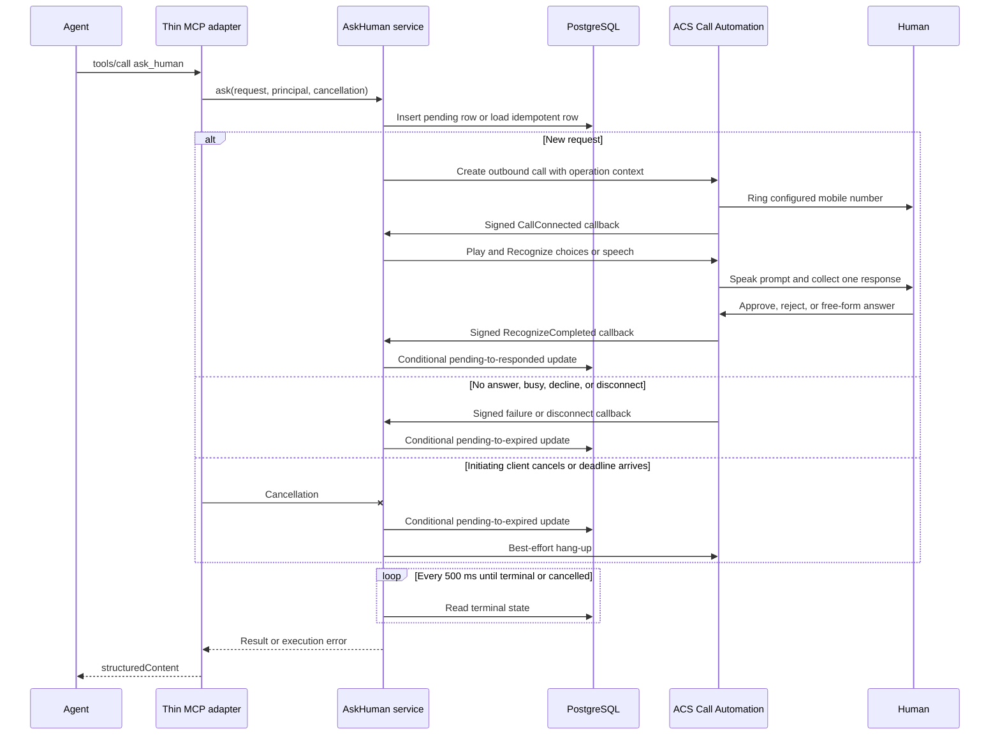

## Research Questions

* Should the service be MCP-first or expose an HTTP core with a thin MCP adapter?
* Should the tight MVP use PostgreSQL, in-memory state, or lighter Azure persistence?
* What are the exact minimal request, result, and error schemas?
* How should the 210-second deadline map call, user, disconnect, and cancellation outcomes?
* What idempotency, authentication, authorization, and abuse controls are required?
* What telemetry is sufficient without recording sensitive content?
* In what sequence should the selected architecture be implemented?
* How does ACS Call Automation Play and Recognize fit now, and what changes for a later Voice Live bridge?

## Status

Complete as of 2026-09-15. The decisions below resolve the service architecture
questions left open by README.md, repository-scope-research.md, and
minimal-mvp-architecture-research.md. They assume the separately selected voice
path: Azure Communication Services (ACS) Call Automation Play and Recognize with
Azure Speech, not a Voice Live media bridge, for the tight MVP.

## Decision Summary

Build one Azure Container App with three boundaries:

* `POST /v1/requests` is the authoritative synchronous HTTP JSON contract.
* `/mcp` exposes one `ask_human` tool through Streamable HTTP. Its handler only
  validates MCP input, supplies the authenticated principal, translates
  cancellation, invokes the same in-process application service as the HTTP
  route, and maps the result back to MCP `structuredContent`.
* `POST /v1/callbacks/acs` receives ACS Call Automation events and validates the
  ACS-signed JSON Web Token (JWT).

Use Azure Database for PostgreSQL Flexible Server as the only coordination and
persistence store. One request row provides idempotency, callback correlation,
terminal-state arbitration, result replay, and short-lived payload retention.
Do not add a queue, cache, event bus, workflow engine, or separate worker.

Use one outbound ACS call and one Play-and-Recognize action. Approval uses
`choices` with fixed `approve` and `reject` labels plus DTMF fallbacks. Input uses
`speech` and returns the recognized text. There is no recognition retry. Every
accepted request has one non-extendable 210-second end-to-end deadline.

This is **HTTP core plus a thin MCP adapter**, not MCP-first. It preserves the
README's likely MCP entry point without coupling telephony callbacks, persistence,
state transitions, and tests to one agent protocol. The adapter is in the same
process and does not call the HTTP route over the network.

## Selected Deployment Shape

The tight MVP contains these runtime components:

* One Azure Container App hosts the HTTP API, MCP adapter, ACS callback, deadline
  timers, and Play-and-Recognize orchestration.
* One Azure Database for PostgreSQL Flexible Server stores one `human_requests`
  table.
* One ACS resource supplies the outbound-enabled number and Call Automation.
* One connected Azure AI multi-service resource supplies text-to-speech and
  speech recognition for Play and Recognize.
* One Application Insights resource receives Azure Monitor OpenTelemetry data.

Configure at least one Container Apps replica to avoid a cold start consuming the
human deadline. Durable PostgreSQL state remains required because deployments,
maintenance, process failure, or scale-out can replace or add replicas, and ACS
callbacks are independent HTTP requests.

The destination is never caller-controlled. Load `MY_MOBILE_NUMBER` from a
Container Apps secret, validate it as E.164 at startup, and fail readiness when it
is absent or invalid. The ACS source number, resource identifiers, locale, and
voice name are also deployment configuration, not tool arguments.

## Evidence and Analysis

### HTTP Core Versus MCP-First

The current MCP `2026-07-28` specification supports the desired user experience.
A remote `tools/call` arrives in an HTTP `POST`; the server can hold the request
and return JSON or a request-scoped Server-Sent Events stream whose final event is
the JSON-RPC response. MCP defines no universal maximum request time. It directs
senders to use configurable timeouts and retain a maximum timeout even when
progress resets an idle timer.

MCP also supports a tool `outputSchema`, `structuredContent`, and `isError` for
tool execution failures. These features make the MCP adapter small. They do not
make MCP a useful internal orchestration protocol: ACS delivers separate HTTPS
CloudEvents, state must survive across requests, and HTTP authentication and
cancellation still govern the remote transport.

An MCP-first domain would make protocol result envelopes and JSON-RPC lifecycle
rules the owning abstraction for an otherwise ordinary request-state machine. A
pure HTTP service would be fastest by a small margin but would omit the README's
preferred agent integration. One application service with two entry adapters
keeps both costs small and prevents duplicated behavior.

### Persistence Decision

Keep PostgreSQL. The evidence does not strongly favor removing a stack component
that the README explicitly names.

In-memory state is unsuitable even for this proof of concept. Container Apps can
create multiple replicas, route requests to them, replace them during maintenance,
and scale a revision to zero unless a minimum is configured. Session affinity
routes requests from one client to one replica, but an ACS callback is a different
client and carries no agent affinity cookie. A restart would also lose the result
while the paid phone call remained active.

Azure Table Storage can durably hold the row, but it is not faster in this
repository. Its model requires a `PartitionKey` and `RowKey`, optimistic
concurrency through ETags, and explicit conditional update handling. Atomic
multi-entity transactions are restricted to one partition. Cosmos DB Table API
would add another service choice, account model, SDK configuration, and cost
decision without improving this one-row workflow. Either option also contradicts
the named PostgreSQL stack for no demonstrated delivery benefit.

PostgreSQL supplies the exact primitives required here. A unique constraint on
the authenticated subject and idempotency key prevents duplicate calls.
`INSERT ... ON CONFLICT` guarantees an atomic insert-or-update outcome under
concurrency. A conditional `UPDATE ... WHERE status = 'pending'` makes the first
terminal event win. Azure Database for PostgreSQL is managed, encrypted at rest
and in transit, supports a low-cost Burstable tier, and has automatic backups.

Use this single logical table:

```sql
CREATE TABLE human_requests (
    request_id uuid PRIMARY KEY,
    subject_id text NOT NULL,
    idempotency_key text NOT NULL,
    request_hash char(64) NOT NULL,
    kind text NOT NULL CHECK (kind IN ('approval', 'input')),
    prompt text NOT NULL,
    status text NOT NULL CHECK (status IN ('pending', 'responded', 'expired')),
    outcome text,
    answer text,
    error_code text,
    acs_call_connection_id text,
    created_at timestamptz NOT NULL,
    expires_at timestamptz NOT NULL,
    completed_at timestamptz,
    UNIQUE (subject_id, idempotency_key)
);
```

Treat ACS identifiers as opaque unbounded text. The Call Automation documentation
explicitly warns against fixed-width columns for `ServerCallId` and `recordingId`;
the same conservative storage rule avoids coupling to an observed identifier
length.

Store the prompt and recognized answer only because callbacks and idempotent
replay require them. Delete the complete row 24 hours after terminal completion.
This defines the idempotency replay window and avoids creating request history.
Store no audio, intermediate recognition hypotheses, or full call transcript.
Run a small idempotent expiry and purge loop in the app; duplicate loops across
replicas are harmless because their SQL updates are conditional.

### ACS Play and Recognize Fit

Call Automation uses an action-event model over REST and HTTPS callbacks. It
emits `CallConnected`, `CallDisconnected`, `CreateCallFailed`,
`RecognizeCompleted`, `RecognizeFailed`, and `RecognizeCanceled`. The Recognize
guide documents these result forms:

* Choice recognition returns the configured label and recognized phrase. Use the
  label only for the business result.
* Speech recognition returns free-form text in `SpeechResult.Speech`.
* Recognition failure identifies initial-silence timeout, unmatched speech
  option, incorrect DTMF, or other result information.
* Initial silence has a documented maximum of 20 seconds for speech and choices.

This path satisfies one bounded spoken decision or answer without application
media handling. It intentionally narrows the README's Voice Live wording for the
first release. It is not a multi-turn LLM conversation and cannot ask semantic
clarifying questions.

## Service Contract

### HTTP and MCP Entry Points

The HTTP operation is `POST /v1/requests`. A successful terminal result uses
HTTP 200. The request body is identical to the MCP `ask_human` arguments. The
fixed deadline and fixed destination are not caller inputs.

The MCP tool declares the request schema as `inputSchema` and the result schema
as `outputSchema`. On success it returns a short text summary in `content` and the
exact result object in `structuredContent`. Input-schema violations use the MCP
protocol's invalid-arguments error. Failures after valid tool dispatch return the
error object in `structuredContent`, a sanitized text equivalent in `content`,
and `isError: true`. Authentication failures occur at the Streamable HTTP
boundary as HTTP 401 or 403, before `tools/call` executes.

### Exact Request Schema

```json
{
  "$schema": "https://json-schema.org/draft/2020-12/schema",
  "type": "object",
  "additionalProperties": false,
  "required": ["kind", "prompt", "idempotencyKey"],
  "properties": {
    "kind": {
      "type": "string",
      "enum": ["approval", "input"]
    },
    "prompt": {
      "type": "string",
      "minLength": 1,
      "maxLength": 2000,
      "pattern": "\\S"
    },
    "idempotencyKey": {
      "type": "string",
      "format": "uuid"
    }
  }
}
```

Normalize `prompt` by trimming leading and trailing whitespace before hashing and
speech synthesis. The 2,000-character product limit leaves room below the ACS
4,000-character text-to-speech limit for a short service introduction and the
fixed approval instructions. Do not silently truncate input.

### Exact Result Schema

```json
{
  "$schema": "https://json-schema.org/draft/2020-12/schema",
  "type": "object",
  "additionalProperties": false,
  "required": ["requestId", "status", "outcome"],
  "properties": {
    "requestId": {
      "type": "string",
      "format": "uuid"
    },
    "status": {
      "type": "string",
      "enum": ["responded", "expired"]
    },
    "outcome": {
      "type": "string",
      "enum": [
        "approved",
        "rejected",
        "answered",
        "no_answer",
        "busy",
        "declined",
        "disconnected",
        "cancelled",
        "deadline_exceeded"
      ]
    },
    "answer": {
      "type": "string",
      "minLength": 1,
      "maxLength": 4000,
      "pattern": "\\S"
    }
  },
  "oneOf": [
    {
      "properties": {
        "status": { "const": "responded" },
        "outcome": { "enum": ["approved", "rejected"] }
      },
      "not": { "required": ["answer"] }
    },
    {
      "properties": {
        "status": { "const": "responded" },
        "outcome": { "const": "answered" }
      },
      "required": ["answer"]
    },
    {
      "properties": {
        "status": { "const": "expired" },
        "outcome": {
          "enum": [
            "no_answer",
            "busy",
            "declined",
            "disconnected",
            "cancelled",
            "deadline_exceeded"
          ]
        }
      },
      "not": { "required": ["answer"] }
    }
  ]
}
```

`pending` is an internal persisted state, not a possible response from the
synchronous operation. A phone call that the owner declines is `expired` with
`declined`; an answered approval call in which the owner says reject is
`responded` with `rejected`.

### Exact Error Schema

```json
{
  "$schema": "https://json-schema.org/draft/2020-12/schema",
  "type": "object",
  "additionalProperties": false,
  "required": ["requestId", "code", "message", "retryable"],
  "properties": {
    "requestId": {
      "type": ["string", "null"],
      "format": "uuid"
    },
    "code": {
      "type": "string",
      "enum": [
        "invalid_request",
        "unauthenticated",
        "forbidden",
        "idempotency_conflict",
        "rate_limited",
        "dependency_failure",
        "internal"
      ]
    },
    "message": {
      "type": "string",
      "minLength": 1,
      "maxLength": 256
    },
    "retryable": {
      "type": "boolean"
    }
  }
}
```

Use these HTTP mappings: 400 `invalid_request`, 401 `unauthenticated`, 403
`forbidden`, 409 `idempotency_conflict`, 429 `rate_limited`, 502
`dependency_failure`, and 500 `internal`. Authentication and validation failures
have a null `requestId`; failures after durable acceptance include it. Set
`retryable` to true only for 429, 502, and 500. This flag does not authorize an
automatic server retry or a duplicate call. A caller retry must reuse the same
idempotency key.

Human availability is not a service error. No answer, busy, phone decline,
disconnect, cancellation, and deadline expiry all return a valid terminal result.
Configuration, ACS authorization, database, and unexpected recognition-service
failures return an error. If a dependency failure occurs after row creation, mark
the row `expired` with internal outcome `dependency_failure`, retain the public
error code, and replay the same error for that idempotency key.

## Lifecycle and Deadline Mapping

### Deadline Ownership

Container Apps HTTP ingress has a fixed 240-second request timeout. Set the
AskMyHuman service deadline to 210 seconds from the committed insertion of the
validated request row through terminal persistence and response serialization.
Use a monotonic process clock for active timers and `expires_at` in PostgreSQL for
cross-request enforcement.

Configure MCP and direct HTTP clients to wait at least 225 seconds. The 15-second
client margin allows the service to return its own terminal result; the remaining
15 seconds stays below the platform's 240-second limit. MCP progress events may
keep an idle-aware client informed but never extend 210 seconds.

At 205 seconds, stop starting media work, conditionally persist
`expired/deadline_exceeded`, and issue a best-effort ACS hang-up. Reserve the final
five seconds for database completion and response serialization. Any earlier
phase can consume the shared budget. There is no call, recognition, or channel
retry.

### State Transitions

All callback handlers first authenticate the ACS JWT, locate the request, and
attempt one conditional update. A successful human result updates only when
`status = 'pending'` and database time is earlier than `expires_at`. Deadline and
cancellation updates use the same pending-state guard. The first terminal update
wins; later callbacks are acknowledged with HTTP 200 and ignored.

Map events as follows:

* `RecognizeCompleted` with choice label `approve` transitions
  `pending -> responded/approved`.
* `RecognizeCompleted` with choice label `reject` transitions
  `pending -> responded/rejected`.
* `RecognizeCompleted` with nonblank `SpeechResult.Speech` transitions
  `pending -> responded/answered` and stores the trimmed recognized text as
  `answer`.
* `RecognizeFailed` with initial-silence timeout or an unmatched option
  transitions `pending -> expired/no_answer`. A blank speech completion uses the
  same mapping.
* `CreateCallFailed` with ACS code/subcode `480/560480` transitions
  `pending -> expired/no_answer`.
* A result carrying `540486`, `560486`, subcode `8539` or `8540`, or SIP code
  `486` transitions `pending -> expired/busy`.
* A result carrying subcode `8538`, SIP code `603`, or the documented
  `CallDisconnected 487/10024` all-endpoints-declined result transitions
  `pending -> expired/declined`.
* `CallDisconnected` before a valid result transitions
  `pending -> expired/disconnected` unless its result information matches a more
  specific no-answer, busy, or declined rule. A disconnect after terminal
  response changes nothing.
* `RecognizeCanceled` that was not caused by an already persisted deadline or
  hang-up transitions `pending -> expired/cancelled`.
* Cancellation of the HTTP invocation that created the row, including closure of
  an MCP Streamable HTTP response stream, transitions
  `pending -> expired/cancelled`, then issues a best-effort hang-up. MCP sends no
  response after cancellation, as required by the specification. A later
  idempotent replay receives the stored cancelled result.
* Reaching the service work cutoff transitions
  `pending -> expired/deadline_exceeded` and issues a best-effort hang-up.

ACS documents no separate webhook event type for busy, decline, or no answer.
Classification depends on `ResultInformation` and, for direct routing, optional
carrier-supplied SIP or Q.850 details. Do not parse human-readable messages. If a
carrier does not supply a documented machine code, use `disconnected` rather than
guessing. An unclassified technical `CreateCallFailed` result is
`dependency_failure`, not a human outcome.

### Idempotent Replay and Races

Canonicalize the normalized request JSON, hash it with SHA-256, and scope the
idempotency key to the authenticated subject. In one transaction:

1. Attempt to insert the pending request with a generated UUID and the 210-second
   expiry.
2. On unique conflict, load the existing row.
3. Return `idempotency_conflict` when the stored request hash differs.
4. Replay the stored result or error when the hash matches and the row is
   terminal.
5. Wait on the existing row without creating another call when the hash matches
   and the row remains pending.

The invocation that inserted the row owns business cancellation. Cancellation of
a duplicate replay waiter stops that waiter but does not terminate the shared
phone call. The initiating invocation's cancellation terminates the row and all
remaining waiters observe `expired/cancelled`.

Use a 500-millisecond PostgreSQL poll while waiting. At tight-MVP volume this is
less infrastructure and less failure handling than Redis, a queue, or PostgreSQL
`LISTEN/NOTIFY`, while adding at most half a second of completion latency.

## Security, Idempotency, and Telemetry

### Agent Authentication and Authorization

Protect `/mcp` and `/v1/requests` with Container Apps built-in Microsoft Entra
authentication and set unauthenticated behavior to `Return401`. Register
AskMyHuman as the protected resource and define one application role,
`AskHuman.Invoke`. Noninteractive agents use OAuth 2.0 client credentials,
preferably a managed identity or workload identity rather than a client secret,
and request a token for the AskMyHuman Application ID URI.

Container Apps validates the token, but its documentation states that application
role authorization remains application code's responsibility. Require the
`AskHuman.Invoke` role and an explicit allowlist of client application IDs. Bind
the idempotency scope to the validated subject or client ID, never to a caller
header.

For MCP authorization discovery, publish OAuth Protected Resource Metadata at
`/.well-known/oauth-protected-resource` and advertise the Microsoft Entra issuer
and `AskHuman.Invoke` scope or role mapping. Validate that every bearer token was
issued for the AskMyHuman resource. The current MCP authorization specification
requires protected-resource metadata discovery and resource/audience binding for
remote HTTP servers.

The service has one human, so permit only one distinct pending request globally.
An idempotent replay may join that row. A new key while another call is pending
returns 429 with `rate_limited`; the direct HTTP response includes `Retry-After`
bounded by the pending row's expiry. This control prevents overlapping calls and
caps the most direct cost-abuse path without adding a general quota service.

### ACS Callback Authentication

Exclude only `/v1/callbacks/acs` from Container Apps Entra authentication by
using `globalValidation.excludedPaths`. The route is not unauthenticated in
application terms. Validate every callback's bearer JWT against the ACS Call
Automation OpenID configuration, signature, issuer, expiration, and audience.
The audience must be the configured ACS resource ID. Microsoft documents a
five-minute token lifetime and a new signed token for every mid-call event.

Pass the server-generated request UUID as ACS operation context, then verify the
stored ACS call connection identifier when it is available. Reject malformed or
invalidly signed callbacks with 401. Return 200 for authenticated duplicate,
late, or already-terminal callbacks to stop redelivery without changing state.

### Secrets and Sensitive Data

Keep `MY_MOBILE_NUMBER`, ACS credentials, database credentials, and any client
secret in Container Apps secret references. Prefer managed identity for ACS,
Azure AI, PostgreSQL, and Azure Monitor where supported. Never accept a phone
number, callback URL, voice resource, or locale override from the agent.

Request prompts and answers can contain confidential information. They may exist
in PostgreSQL for the 24-hour replay window and in the direct response, but they
must not appear in URLs, telemetry, exception text, health responses, or ACS
operation context. Disable HTTP request and response body logging.

### Minimal Telemetry

Use Azure Monitor OpenTelemetry with Application Insights. Carry the W3C trace
context through in-process HTTP/MCP work and add random `request_id` as a custom
correlation attribute to the original request span and independently arriving
ACS callback spans. Do not place the prompt in the span name.

Emit these spans:

* `askhuman.request` for the waiting operation
* `askhuman.postgres` for insert, terminal update, and replay reads
* `askhuman.acs.create_call` for outbound call creation
* `askhuman.acs.callback` with callback event type
* `askhuman.acs.recognize` for the Play-and-Recognize action

Emit these metrics with only the listed low-cardinality dimensions:

* `askhuman_requests_total` with `kind`, terminal `status`, and `outcome`
* `askhuman_duration_ms` with `kind`, terminal `status`, and `outcome`
* `askhuman_dependency_failures_total` with `dependency`, `operation`, and
  numeric ACS code or stable application error code
* `askhuman_pending` as a zero-or-one gauge

Trace attributes may include `request_id`, `kind`, `status`, `outcome`, elapsed
milliseconds, ACS event type, ACS numeric code/subcode, and whether an
idempotency replay occurred. Do not record the phone number, prompt, answer,
recognized phrase, raw ACS payload, idempotency key, authorization header, JWT
claims, client secret, or database connection string. Hash the authorized client
ID with a deployment-specific telemetry salt only if per-client diagnostics are
necessary; omit it for the first deployment.

Set Application Insights retention to 30 days, the documented minimum option.
Telemetry is immutable after ingestion and purge is a separate operation, so
preventing sensitive ingestion is stronger than relying on later deletion.

## Sequence Diagram



## Implementation Sequence

1. Check in the three JSON Schemas above and contract tests for every valid result,
   every invalid discriminator combination, and every error code. Implement a
   protocol-neutral `AskHumanService.ask` interface that accepts the validated
   request, authenticated subject, and cancellation signal.
2. Add the one PostgreSQL migration, request repository, atomic idempotent insert,
   conditional terminal update, stale-pending expiry, 500-millisecond waiter, and
   24-hour purge. Test duplicate keys, changed payloads, simultaneous callbacks,
   deadline races, and replay before adding ACS.
3. Implement `POST /v1/requests` with Entra authentication, role and client-ID
   authorization, one-pending-request admission control, cancellation propagation,
   exact HTTP status mapping, and body logging disabled. Use a fake call driver to
   prove the synchronous 210-second state machine.
4. Implement `POST /v1/callbacks/acs` with ACS OpenID discovery and JWT validation.
   Add fixture tests for invalid issuer, audience, signature, expiration, duplicate
   callbacks, late callbacks, and unknown request context.
5. Implement the smallest ACS driver from the official Python outbound-calling
   sample: create one call, handle `CallConnected`, start one choices or speech
   recognition action, map the documented machine codes, acknowledge, and hang
   up. Add no retry and no application audio streaming.
6. Add the `/mcp` Streamable HTTP endpoint and one `ask_human` tool. Reuse the
   checked-in schemas, map the authenticated principal and stream close to the
   core service, and keep all persistence and ACS logic out of the adapter.
7. Add Azure Monitor OpenTelemetry spans and the four metrics after behavior is
   correct. Assert in tests that prompts, answers, phone numbers, idempotency keys,
   tokens, and callback bodies never enter logs or span attributes.
8. Provision one Container App with minimum replicas set to one, PostgreSQL
   Flexible Server on a Burstable development SKU, ACS, the connected Azure AI
   resource, and Application Insights. Configure Entra auth with only the ACS
   callback path excluded, managed identities, secret references, and readiness
   validation.
9. Run real end-to-end calls for approve, reject, free-form answer, initial
   silence, no answer, busy, phone decline where the carrier exposes it,
   mid-call disconnect, initiating-client cancellation, and forced deadline.
   Verify one phone call per idempotency key and one terminal row per request.

This order front-loads the contract and race behavior, which can be tested without
paid calls, then adds one provider workflow and finally the MCP translation.

## Later Voice Live Bridge

A future Voice Live release does not change the public request, result, error,
idempotency, authentication, PostgreSQL, deadline, or telemetry-redaction
contracts. Preserve that option by keeping ACS operations behind the narrow call
driver used by `AskHumanService`, not by building a general provider framework.

Replacing Play and Recognize with Voice Live adds substantial runtime behavior:

* ACS must stream bidirectional PCM audio to an application WebSocket.
* The application must maintain a second authenticated Voice Live WebSocket,
  translate audio envelopes, manage buffering and backpressure, and coordinate
  interruption and cleanup.
* Voice Live function calling or a validated final-intent event must invoke the
  same conditional completion method used by `RecognizeCompleted`.
* The media relay needs its own connection limits, latency spans, and failure
  metrics, but it must not emit audio or transcripts to telemetry.

The official Microsoft telephony architecture is an application-hosted bridge,
not a native Voice Live attachment to an ACS phone number. Keeping the stable
service contract outside the call driver confines that later change to voice
orchestration and deployment capacity. Re-evaluate whether 210 seconds remains
adequate before enabling multi-turn conversation, but do not let progress or
conversation turns extend an accepted request's deadline silently.

## Sources

All external sources were accessed on 2026-09-15.

### Local Evidence

* README.md
* .copilot-tracking/research/subagents/2026-09-15/repository-scope-research.md
* .copilot-tracking/research/subagents/2026-09-15/minimal-mvp-architecture-research.md
* .copilot-tracking/research/subagents/2026-09-15/voice-options-decision-research.md

### Model Context Protocol

* MCP specification, [Tools](https://modelcontextprotocol.io/specification/2026-07-28/server/tools)
* MCP specification, [Streamable HTTP transport](https://modelcontextprotocol.io/specification/2026-07-28/basic/transports)
* MCP specification, [Cancellation and timeouts](https://modelcontextprotocol.io/specification/2026-07-28/basic/patterns/cancellation)
* MCP specification, [Authorization](https://modelcontextprotocol.io/specification/2026-07-28/basic/authorization)
* IETF, [RFC 9728: OAuth 2.0 Protected Resource Metadata](https://www.rfc-editor.org/rfc/rfc9728)

### Azure Container Apps

* Microsoft Learn, [Ingress in Azure Container Apps](https://learn.microsoft.com/en-us/azure/container-apps/ingress-overview)
* Microsoft Learn, [Scaling in Azure Container Apps](https://learn.microsoft.com/en-us/azure/container-apps/scale-app)
* Microsoft Learn, [Authentication and authorization in Azure Container Apps](https://learn.microsoft.com/en-us/azure/container-apps/authentication)
* Microsoft Learn, [Enable Microsoft Entra authentication in Container Apps](https://learn.microsoft.com/en-us/azure/container-apps/authentication-azure-active-directory)
* Microsoft Learn, [Container Apps authConfigs resource reference](https://learn.microsoft.com/en-us/azure/templates/microsoft.app/containerapps/authconfigs)

### Persistence

* PostgreSQL documentation, [`INSERT` and `ON CONFLICT`](https://www.postgresql.org/docs/current/sql-insert.html)
* Microsoft Learn, [Azure Database for PostgreSQL Flexible Server overview](https://learn.microsoft.com/en-us/azure/postgresql/flexible-server/overview)
* Microsoft Learn, [Design scalable and performant tables](https://learn.microsoft.com/en-us/azure/storage/tables/table-storage-design)

### Azure Communication Services and Voice

* Microsoft Learn, [Call Automation overview](https://learn.microsoft.com/en-us/azure/communication-services/concepts/call-automation/call-automation)
* Microsoft Learn, [Gather user input with Recognize](https://learn.microsoft.com/en-us/azure/communication-services/how-tos/call-automation/recognize-action)
* Microsoft Learn, [Secure a Call Automation webhook](https://learn.microsoft.com/en-us/azure/communication-services/how-tos/call-automation/secure-webhook-endpoint)
* Microsoft Learn, [ACS troubleshooting codes](https://learn.microsoft.com/en-us/azure/communication-services/resources/troubleshooting/voice-video-calling/troubleshooting-codes)
* Microsoft Learn, [Connect ACS with Foundry Tools](https://learn.microsoft.com/en-us/azure/communication-services/concepts/call-automation/azure-communication-services-azure-cognitive-services-integration)
* Microsoft Learn, [Make an outbound Call Automation call](https://learn.microsoft.com/en-us/azure/communication-services/quickstarts/call-automation/quickstart-make-an-outbound-call)
* Microsoft Learn, [Call Automation audio streaming](https://learn.microsoft.com/en-us/azure/communication-services/concepts/call-automation/audio-streaming-concept)
* Microsoft Learn, [Voice Live telephony accelerator](https://learn.microsoft.com/en-us/azure/ai-services/speech-service/voice-live-telephony)
* Microsoft-owned sample, [Python Call Automation outbound calling](https://github.com/Azure-Samples/communication-services-python-quickstarts/blob/052a2dca2f369631ed353a7d0cff9e4aec339280/callautomation-outboundcalling/main.py)

### Observability and Privacy

* Microsoft Learn, [Application Insights data collection, retention, and privacy](https://learn.microsoft.com/en-us/azure/azure-monitor/app/data-retention-privacy)
* Microsoft Learn, [Application Insights distributed tracing](https://learn.microsoft.com/en-us/azure/azure-monitor/app/distributed-trace-data)

## Residual Questions

The service architecture does not depend on these deployment inputs, but a live
demonstration does:

* Which country or region contains the owner's number, and can the Azure
  subscription acquire an outbound-enabled ACS number there?
* Which Microsoft Entra tenant, agent application IDs, and managed identities are
  authorized for `AskHuman.Invoke`?
* Can every target MCP client configure at least a 225-second request timeout and
  surface Streamable HTTP cancellation correctly?
* Does the target organization's data policy approve a 24-hour encrypted
  PostgreSQL payload window and 30-day content-free telemetry retention?
* Must the demonstration distinguish phone decline from generic disconnect on
  every carrier? ACS can classify decline only when documented machine-readable
  result information is present.

No further service architecture research is required before implementation. The
remaining work is deployment validation against the chosen tenant, subscription,
carrier region, and MCP client.